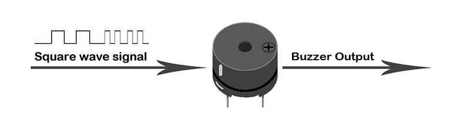
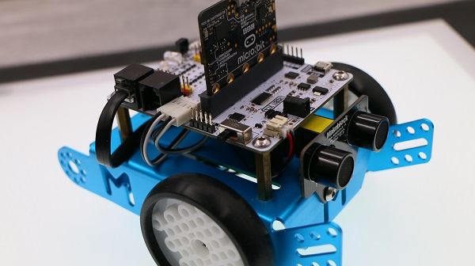
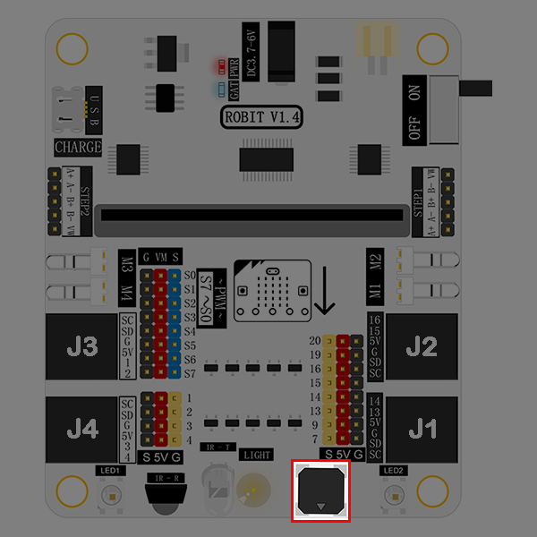
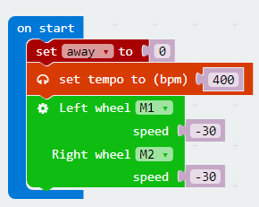
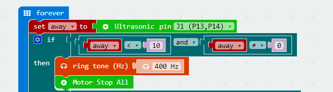
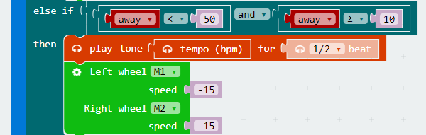

# case 05 Reversing Alarm

## Our Goal  
---

- Make mBot car realize the function of reversing alarm. 

## Material Needed
---

- 1 x Robit
- 1 x Mbot Car

## Background Knowledge
---

### Buzzer

- Buzzer is a sound component that consists of a vibrator and a resonantor. According to the control method, the buzzer can be further divided into active type and passive type.

- Working Principle of Active Buzzer:
Inside the buzzer, it has integrated an oscillating system and amplified sampling circuit. When DC current pass through the buzzer, the resonantor will generate an acoustic signal.

- Here's the flow chart of active buzzer working principle:

- Working Principle of Passive Buzzer:
Convert the square wave input into sound signal output via the resonantor. 

- Here's the flow chart of passive buzzer working principle:

**Note:** In this experiment, what we have used is passive buzzer. 

### Introduction

- In the chapter of [Ultrasonic Obstacle Avoidance](/Robit_Case_02/), we have realized to detecting abstocles with ultrasonic module. In this chapter, we are going to use ultrasonic module and buzzer to make mBot car realize reversing alarm function. 

## Assembly
---

Connect the left motor to M1 and the right motor to M2. 

Plug in ultrasonic module to J1. In this project, our goal is to realize reversing alarm function. Therefore, the ultrasonic module needs to be installed at the tail of the mBot car. 

The buzzer is marked in the picture below. It is connected to P0 port on micro:bit. 

## Software
---

[Microsoft Makecode](https://makecode.microbit.org/#)

## Programming
---

### Step 1

Click **Advanced** in the code drawer of Makecode to see more options. 

To program for the ultrasonic module, we have to add a package. Find **Add Package** in the bottom of code drawer and click it. This will pop up a dialogue box. Search "Robit" in the box and click on it to download this package. 

**Note:**
If you get a hint that some packages will be deleted due to the problem of incompatibility, you can either follow the prompts, or create a new project in the project menue.

### Step 2

At the beginning of our program, we set the frequency of buzzer to be 400Hz and the motor speed to be -30.

### Step 3

Create a forever loop and store the returned data of the ultrasonic module into variable away. 

If the distance between the car and the wall is 10cm or less, the buzzer alarms and the motors stop at the same time. 

If the distance is less than 50cm but beyond 10cm, the buzzer alarms in 1/2 beat and set the motor speed to be -15. 

If the distance is beyond 50cm, the buzzer alarm in 4 beats and set the motor speed to be -30. 

## Program
---

You can see the whole program from the link here: [https://makecode.microbit.org/_gFiciE4PLF37](https://makecode.microbit.org/_gFiciE4PLF37)

Or you can download it from the page below:

<iframe style="position:absolute;top:0;left:0;width:100%;height:100%;" src="https://makecode.microbit.org/#pub:_gFiciE4PLF37" frameborder="0" sandbox="allow-popups allow-forms allow-scripts allow-same-origin"></iframe>
  

---
**Note:** Setting the motor speed too low will cause the motor to operate abnormally.

## Result
---

When the distance between mBot car and the wall is beyond 50cm, the buzzer will alarm in 4 beats and the motors will run in full speed. 

When the distance is less than 50cm but beyond 10cm, the buzzer will alarm in 1/2 beat and the motors will run in half speed. 

When the distance is less than 10cm, the buzzer will keep alarming and the motor will stop running. 

## Think 
---

Why we have to judge if the distance is 0 during parking? 

## FAQ
---

**Q:** Why it can't avoid obstacles after turning on micro:bit 5x5 dot screen?

**A:** The LED dot matrix display will seriously slow down the running speed of the program, causing the car to detect obstacles more slowly. To make the program run smoothly, it is recommended to disable the 5x5 display.  

