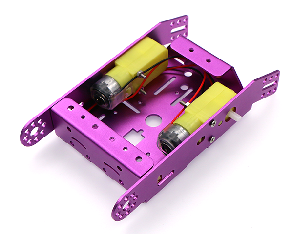
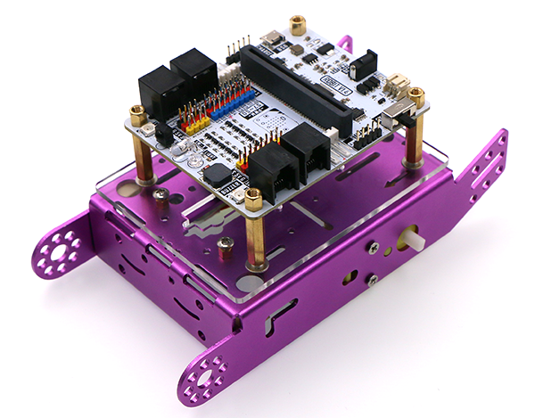
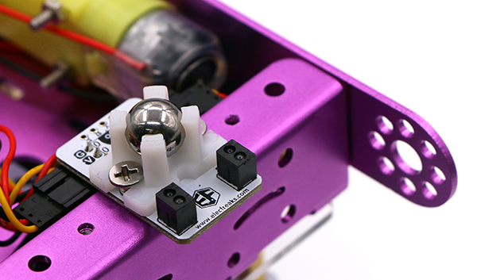
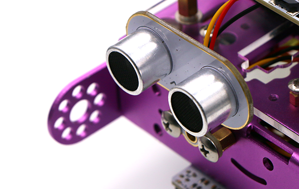
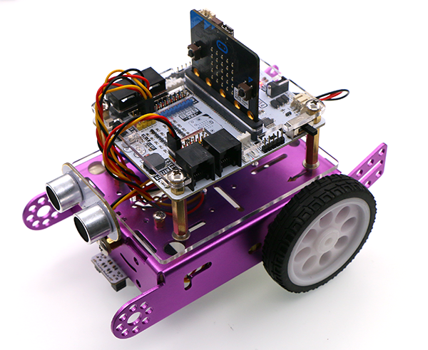

# Kit Introduction

## Introduction  
---
Robit smart car is a kind of smart car which is based on micro:bit and ElecFreaks robit. Besides the RJ25 wiring port and  motor port in Mbot, the robit is also equipped with  2-way DC motor connectors , 2-way stepping motor connectors(Stepping motor connectors and 4-way DC motor connectors are multiplexed ) and 8-way PWM signal output connectors.  It can drive PWM signal driving devices like servo. It has 8-way G-5V-S digital signal connectors(for connecting with OCTOPUS electric bricks) and 4-way G-5V-S analog signal connectors(for connecting with OCTOPUS electric bricks). Robit can realize all current basic functions of MBOT and it can be regarded as the new generation of Mbot.

### Characteristics
---
- Support 4 channels of DC motor and 2 channels of stepping motors.
- With 8-way PWM signal output connectors.
- With 8-way G-5V-S digital signal connectors(for OCTOPUS electric brick).
- With 4-way G-5V-S analog signal connectors(for OCTOPUS electric brick).
- DC power supply input voltage: DC 3.7V-6V.
- Lithium battery power supply input voltage: DC 3.7-4.2V.

###  Technical Parameter
---
Item |Parameter 
:-:|:-:
Name|Robit Smart Car
SKU|EF08195
Version|V1.0
Motor Type|TT Motor
Wheels Number|2 
Line-following|Support
Sonar|Support
Power Source|Lithium battery
Net Weight|426g
Dimension of Finished Products|170mm X 128mm X 98mm

## Lists of Components
---
Item |Quantity |Remark
:-:|:-:|:-:
Chassis|1|-
Robit|1|-
Sonar bit|1|-
Dual Line-following Modules|1|-
TT Motor|2|-
Battery|1|-
Screws Package|1|-

## Diagram for Installment of Chassis
---
### Step 1: Install TT motor with four M3*25 Countersunk Screws

###  Step 2:  Stick the hook side of the Hook&Loop to the acrylic board(functioned as a adapter plate), and install four M4*25mm bi-pass copper cylinders.

Sti
### Stepper 3: Install 4  M3*4+4 single-pass copper cylinders on the upper side of the aluminum chassis. 

### Step 4 : Install the acrylic board to the chassis with four M3*5 screws.

###  Step 5: Install ElecFreaks Robit to the chassis with four M3*5 single-pass copper cylinders.

### Step 6: Install the Fender with M4*5 screws.   

###  Step 7: Install the universal wheel and line-following module with 2 M4*10 countersunk screws. 

###  Step 8: Install the wheels.

###  Step 8: Install 2 M4*6+6 single-pass copper cylinders on the head of the car.

###  Step 10: Install sonar module with 2 M4*5 screws.

### Step 11: Stick the loop side of the Hook&Loop onto the battery.

### Step 12: Stick the battery to the acrylic board, and connect it to the main board.

### Finished Products
---

## Sample Code
Click "**Add Package**" and  search with "**robit**", then add the robit package.

### The code of moving forward is list below, you can have your car moving forward after downloading.
[https://makecode.microbit.org/_7RrcC6R3T5MP](http://https://makecode.microbit.org/_7RrcC6R3T5MP)

## File
---

## FAQ
---
