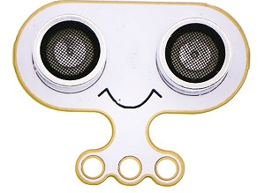

# robit Smart Car kit case01:ultrasonic measurement 

## Our Goal
---

- To understand what is ultrasonic and how to use it to distance measurement.
- Use the robit smart car for distance measurement.

## Requiered Materials
---

- 1 x Robit car

## Background
---

### What is ultrasonic

ultrasonic is a sound wave with a frequency higher than 20,000 Hz. It has good directionality, strong penetrating ability, easy to obtain concentrated sound energy, and has a long distance in water. It can be used for distance measurement, speed measurement, cleaning, welding, crushing, Sterilization, etc.

### Principle of ultrasonic ranging

The ultrasonic transmitter emits ultrasonic waves in a certain direction, and starts timing at the same time as the transmission time. The ultrasonic waves propagate in the air, and immediately return to the obstacle when the obstacle is encountered on the way, and the ultrasonic receiver stops timing immediately on receiving the reflected wave. Calculate the distance according to the time when the receiver receives the ultrasonic wave, similar to the radar ranging.

### Ultrasonic modules ###

- Sonar:bit is a wide pressure module with 3 lines and works under 3.0V-5V with only 3 wires(G、V、S) which  can save an IO port. Sonar:bit has stable measurement data with range at 4cm~400cm and its tolerance is ±1cm. It can be used to measure short range, smart car and robot.

## Hardware connect 
---

As below picture, connect the ultrasonic module to robit board with 3 pin wire.

## Software
---

[makecode](https://makecode.microbit.org/#)

## Coding
---

### Step 1
- Click on "Advanced" in the MakeCode Drawer to see more code sections.

- Search for “robit” and click on the ring:bit car package to add it to your project. (As below picture)

Note：If you get a warning telling you some packages will be removed because of incompatibility issues, either follow the prompts or create a new project in the Project file menu.

### Step 2

Snap the `forever`block from the `Basic`, then snap `show number` under it.

Snap the `Ulirasonic distance` from the `Sonarbit`, then choose `cm` & `P1`. This is a return data `cm` for connecting ultrasonic module to the `P1`.

### Program

Program link：[https://makecode.microbit.org/_DdTdurbyrVvH](https://makecode.microbit.org/_DdTdurbyrVvH)

If you don't want to type these code by yourself, you can directly download the whole program from the link below:

<iframe style="position:absolute;top:0;left:0;width:100%;height:100%;" src="https://makecode.microbit.org/#pub:_DdTdurbyrVvH" frameborder="0" sandbox="allow-popups allow-forms allow-scripts allow-same-origin"></iframe>
  

**Note：** The largesr ranging distance of the ultrasonic module is almost 400cm.

### Result

The ultrasonic module will get feedbacks about distance in time and show the result on the 5X5 screen if the micro:bit.

## Think 
---
In what conditions that the distance is 0 ?

## Questions
---

## More Information 
---

 
