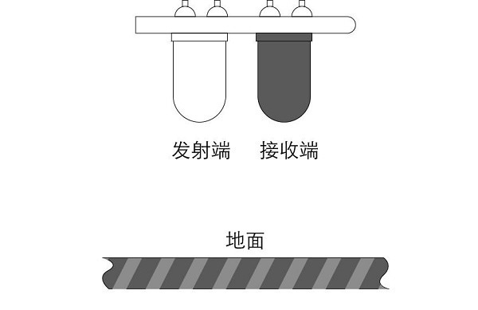
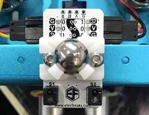
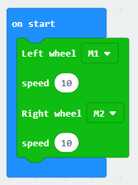
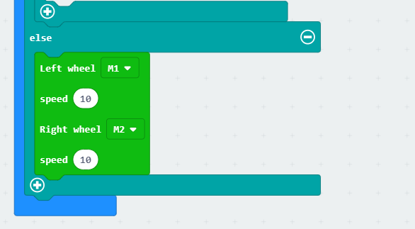
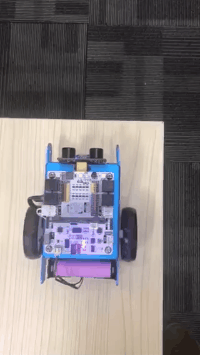

# robit Smart Car kit case02:line follow 

## Our Goal
---

- To understand what is line follow module.
- Use line follow module of the robit car to edge detection.

## Requiered Materials
---

- 1 x Robit

## Background
---
### Principle of line follow ###
- Line follow is Infrared sensor is consist of **transmitting terminal **and**receiver**, the receiver will receive the  infrared ray from ground of the transmitting.
- When it happens to black ground that it can't recieve the infrared ray, the line follow module will back to 1.

### Dual patrol module ###

- Dual patrol module Two sets of reflective infrared pair tubes are integrated to identify black lines. Two 3P-locked DuPont interfaces and one 4P pad can connect two 3P DuPont interfaces directly with two GVS lines. The wiring is very convenient. This module is usually be used to do the smart line car, we can design the black line track arbitrarily, and let the car drive according to the black line track we designed.

 

## Hardware connect 
---

As above picture, connect the dual patrol module to P13、P14 of robit with 3 pin wires.

## Software
---

[makecode](https://makecode.microbit.org/#)

## Coding
---

### Step 1
- Click on "Advanced" in the MakeCode Drawer to see more code sections.

- Search for “robit” and click on the ring:bit car package to add it to your project. (As below picture)

Note：If you get a warning telling you some packages will be removed because of incompatibility issues, either follow the prompts or create a new project in the Project file menu.

### Step 2

On start, set the left wheel to M1, the right wheel to M2 and the speed is 10.

Set the infrared ray sensor to variable left and right to read the parameters of P13 and P14.

If at least one of the left and right infrared rays does not receive feedback (the edge is detected), set the left and right motor speed to a negative number.
Set random number from 0 to 100, if it is less than 50, the M1 servo stops; if it is more than 50, the M2 turns left.

Set the speed of the servo in 10 and go ahead if the the infrared ray sensor nothing.

### Program

Program link：[https://makecode.microbit.org/_gTCFqyau8Uud](https://makecode.microbit.org/_gTCFqyau8Uud)

If you don't want to type these code by yourself, you can directly download the whole program from the link below:

<iframe style="position:absolute;top:0;left:0;width:100%;height:100%;" src="https://makecode.microbit.org/#pub:_gTCFqyau8Uud" frameborder="0" sandbox="allow-popups allow-forms allow-scripts allow-same-origin"></iframe>
  

**Note：** The items can absorb the infrared ray default ro black lines.

## Result
---
The robit car will detect edge and then back to avoid falling.

## Think
---
In what conditions that the distance is 0 ?

## Questions
---

## More Information  
---

 
