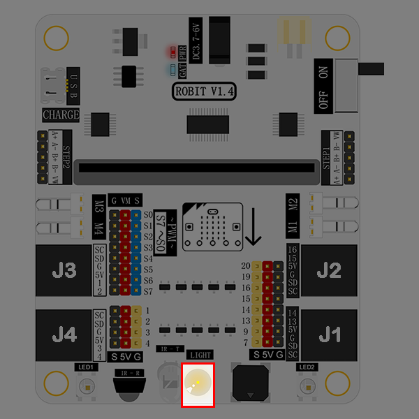
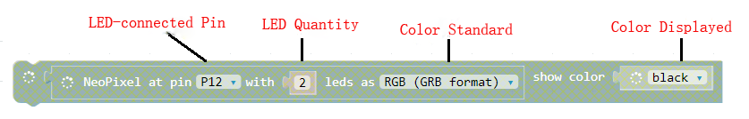
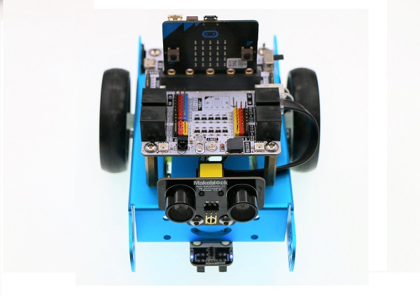

# case 07 Smart Car Light 

## Our Goal 
---
-  Make smart car light with the light sensor and LED on robit. 

## Material Needed
---

- 1 x Robit
- 1 x Mbot Car

## Background Knowledge
---

### Light Sensor

Light sensor generally refers to a device that senses the energy of light from ultraviolet light to infrared light and converts the light energy into an electrical signal. It is mainly composed of photosensitive elements, and is mainly divided into four types: ambient light sensor, infrared light sensor, solar light sensor and ultraviolet light sensor. It is mainly used in the fields of car body changing electronic applications and intelligent lighting systems.

The light sensor on Robit is an <u>ambient light sensor</u>，which indicates the strength of ambient light by numbers. 

## Hardware Connection
---

The light sensor onboard is connected to P10 port on micro:bit. 

Two rainbow LED onboard are connected to P12 port on micro:bit. 

## Software
---

[Microsoft Makecode](https://makecode.microbit.org/#)

## Programming
---

### Step 1

Click **Advanced** in the code drawer of Makecode to see more options. 

To program for robit, we have to add a package. Find **Add Package** in the bottom of the code drawer and click on it. This will pop up a dialogue box. Search for "Robit" and then click it to download this package. 

**Note:**
If you get a hint that some packages will be deleted due to the problem of incompatibility, you can either follow the prompts, or create a new project in the project menue.

### Step 2

Create a forever loop. Read P10(i.e. pin of light sensor) in analog way. Assign the light strength value read to variable item. 

If variable item(i.e. light strength) is under 700, then LED light is white and delay time for 300ms. 

If item is beyond 700, then turn off LED light. 

**Note:** The picture below gives a detailed code explain to LED.

## Program 
---

You can see the whole program from the link here: [https://makecode.microbit.org/_Dyu4j2A4F23c](https://makecode.microbit.org/_Dyu4j2A4F23c)

Or you can download it from the page below. 

<iframe style="position:absolute;top:0;left:0;width:100%;height:100%;" src="https://makecode.microbit.org/#pub:_Dyu4j2A4F23c" frameborder="0" sandbox="allow-popups allow-forms allow-scripts allow-same-origin"></iframe>
  
---

### Result

When the ambient light is strong, turn off the LED light; while the ambient light is dim, then turn on the LED light. 

## Think 
---

## FAQ
---

