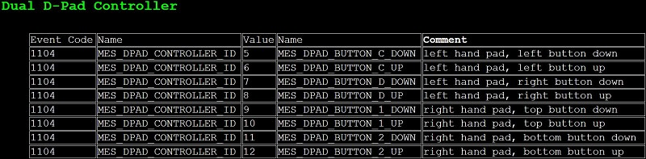
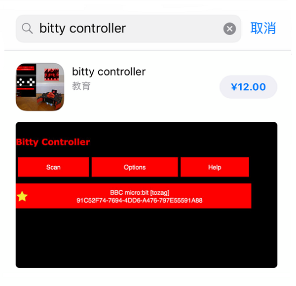
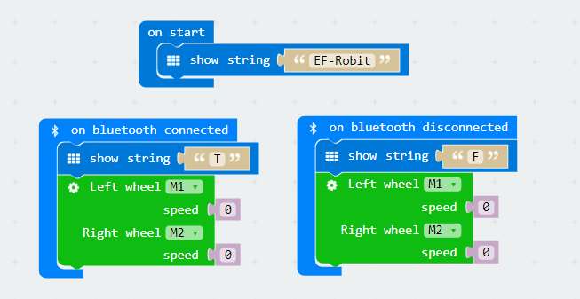
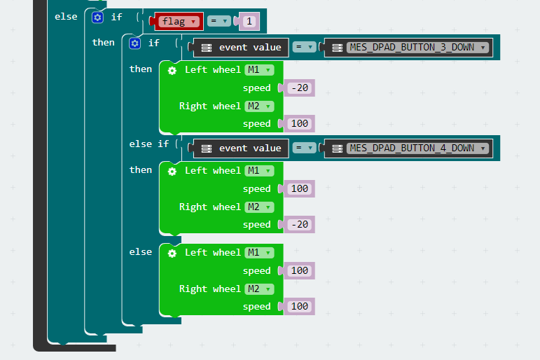
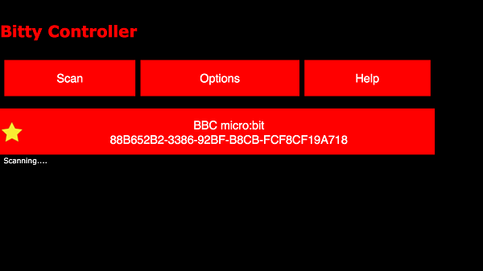

# case 08 Bluetooth remote control 
---
- On the basic of <u>Mbot car</u> car, with <u>Robit car board</u> and use mobile devices to driving the car move by bluetooth.

## Requiered Materials
---

- 1 x Robit
- 1 x Mbot Car 
- 1 x bitty controller

## Background
---
- Bluetooth® is a wireless technology standard for exchanging data over short distances (using short-wavelength UHF radio waves in the ISM band from 2.4 to 2.485 GHz[3]) from fixed and mobile devices, and building personal area networks (PANs). We can use Bluettoth to connect multiple devices which resolves the difficulty of simultanuous data transmission.

- [Bittysoftware](http://www.bittysoftware.com/index.html) provides mobile apps and tools for devices like BBC micro:bit.

### Bluetooth event

An event be triggered ever since received a message from bluetooth. And the further dealing is based on the event.

The event is divided into source and event value. To judge the event by the source.

The D-Pad control handle table as below:

## Software
---
- Enter into[Makecode](https://makecode.microbit.org/#) for online block coding.

## Operation
---
### Step 1：APP preparation

1. Android：Download bitty controller in Google play;

2. IOS：Download bitty controller in APP store.

-  App Interface as below pictures：

***Note:*** It is need other software to connect bluetooth because limit in IOS.

Please refer to 《How to Use Bluetooth IOS system》

### Step 2：Set bluetooth

You need to press A and B at the same time and then press the reset to start bluetooth mode of micro:bit. **PAIRING MODE！** and a special symbol will show in the 5X5 allay. The special symbol is for bluetooth which is different from every micro:bit

A "√" will show in the 5X5 allay when the IOS devices & Android devices is connecting to bluetooth.

### Step 3：Add Package

Click on "Advanced" in the MakeCode Drawer to see more code sections.

We need a new package for coding to bluetooth and Robit. Click on “Add Package” at the bottom of the code block and search for “bluetooth" and “Robit" to add them to your project.

***Note:*** If you get a warning telling you some packages will be removed because of incompatibility issues, either follow the prompts or create a new project in the Project file menu.

### Step 4：Coding block

The EF-Robot title is displayed during initialization. When the Bluetooth connection is connected, the 5X5 allay LED displays T, and the Bluetooth connection is disconnected, the 5X5 allay displays F.

To avoiding negtive effects by wrong operation, set the rotation speed to 0.

Set start block and the event source to `MES_DPAD_CONTROLLER_ID`, it is also a handle panel of APP.

Event information is `MICROBIT_EVT_ANY` to receive all informations.

If the event information is `MES_DPAD_BUTTON_A_DOWN`, refer to bluetooth event information table，known that the information is pressed by the left arrow key, so the running state is set to 1 (move forward state), and the left and right wheel motors are set to advance at full speed.

If the event information is `MES_DPAD_BUTTON_A_UP`，refer to bluetooth event information table，known that the information is up by the left arrow key, so the running state is set to 0(stop state)，and the left and right wheel motors are set to stop.

If the event information is`MES_DPAD_BUTTON_3_DOWN` when the flag is at the state of 1 forward. Take reference to bluetooth event information table, known that the information is pressed by the right arrow key, the left wheel are set to reverse and the right wheel set to turn left.

If the event information is `MES_DPAD_BUTTON_4_DOWN` when the flag is at the state of 1 forward. Take reference to bluetooth event information table, known that the information is pressed by the right arrow key, the right wheel set to reverse and the left wheel set to turn left.

If the received event information is neither as above when the flag is at the state of 1 forward. Then set the left wheel and right wheel move forward at 100 speed.

### Step 5：Bluetooth connection

After the micro:bit was set to bluetooth mode and connect to bluetooth. Click on scan of APP to get micro:bit.

As below picture, enter in handle mode.

Have fun!!!

***Note:*** bitty controller operation[micro:bit foundation](http://www.bittysoftware.com/apps/bitty_controller.html)

### Program

Program link: [https://makecode.microbit.org/_csTEMLE3vgmr](https://makecode.microbit.org/_csTEMLE3vgmr)

Note：If you get a warning telling you some packages will be removed because of incompatibility issues, either follow the prompts or create a new project in the Project file menu.

<iframe style="position:absolute;top:0;left:0;width:100%;height:100%;" src="https://makecode.microbit.org/#pub:_csTEMLE3vgmr" frameborder="0" sandbox="allow-popups allow-forms allow-scripts allow-same-origin"></iframe>
  

***Note:*** When the speed design is too low, it may affect the motor rotation.

## Result
---
T is showing on bluetooth connecting, F is showing on bluetooth disconnecting.

The left button of the control panel controls the car to move forward, and the right and left buttons control the steering.

## Think 
---
How do we code for car reverse ?

## Questions
---

