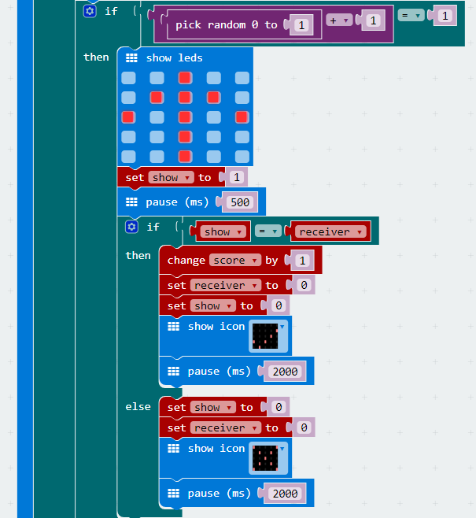
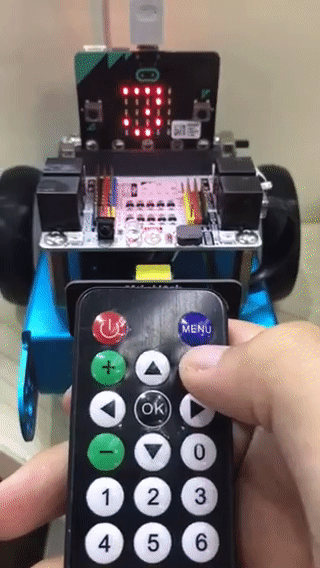

# case 09 Reaction test game 

## Our goal
---
- Use infrared receiver module and infrared controller to play reaction test game.

## Requiered Materials
---

- 1 x Robit car
- 1 x Infrared controller

## Background
---
### Light sensor

Infrared controller is a widely used communication and control method. It is widely used in household appliances, industrial control and intelligent instrument systems because its simple structure, low power consumption, strong anti-interference ability, high reliability and low cost. The universal infrared remote control system consists of two parts: transmitting and receiving. The encoding/decoding dedicated integrated circuit chip is used for control operations.

Robit has an infrared remote control system with transmitting terminal and reciever.

## Hardware connect
---
On-board infrared sensor connects P8 of the micro:bit. 

An infrared remote controller with four directions buttons(up, down, left and right).

## Software
---
[makecode](https://makecode.microbit.org/#)

## Software
---
### Step 1
- Click on "Advanced" in the MakeCode Drawer to see more code sections.

We need a new package for coding to infrared module. Click on “Add Package” at the bottom of the code block and search for “Robit" to add it to your project.

***Note:*** If you get a warning telling you some packages will be removed because of incompatibility issues, either follow the prompts or create a new project in the Project file menu.

### Step 2

On start, initilaize the infrared module to P8. Set receive variable to `receiver`, display variable to `show`, score variable to `score` and game round variable to `num`. 

Initilaize `receiver``score``num` to 0, and set `receiver` to 1 when it sensed the infrared signal.

Set a forever loop to check game rounds. If the num is equal to 5, then show scores, game ends; if the num is not equal to 5, game continues 1 more round and count down 3, 2, 1.

Randomly generate a number from 0 to 1 and plus one, then randomly generate two cases to determine whether it is equal to 1, if equal to 1, display the up arrow, set the display variable to 1, delay 0.5 seconds.

Then judge whether the received variable and the display variable are consistent. If they are consistent, the score variable is incremented by 1, the display variable and the received variable are returned to 0, the score variable is incremented by 1, and display √, delay 2 seconds.

If they are not consistent, the received variable and the display variable returns to 0, display X and delay 2 seconds. 

if the random number is not equal to 1, display the down arrow.

### Program

Program link: [https://makecode.microbit.org/_L9oPJWXxEJKh](https://makecode.microbit.org/_L9oPJWXxEJKh)

If you don't want to type these code by yourself, you can directly download the whole program from the link below:

<iframe style="position:absolute;top:0;left:0;width:100%;height:100%;" src="https://makecode.microbit.org/#pub:_L9oPJWXxEJKh" frameborder="0" sandbox="allow-popups allow-forms allow-scripts allow-same-origin"></iframe>
  

## Result
---
The game starts, After the 321 countdown, the arrow is randomly displayed. The delay is 0.5s to judge whether to press the corresponding arrow.  If the corresponding direction button is pressed at the specified time, √ is displayed, if no X is displayed.
The game are 5 rounds, self end and display scores.
Restart game on the power switch be pressed.

## Think
---

How can you add more reaction buttons?

## Questions
---

