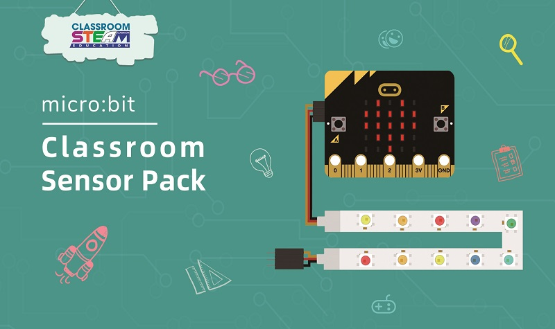

# Introduction to Sensor Pack

## Introduction
---

micro:bit Classroom sensor pack is an entry-level kit, which can be easily connected to micro:bit via basic:bit. We have carefully selected some of the most commonly used electric bricks for classrooms. This kit can help students learn how to build their micro:bit projects quickly.

## Pictures
---

## Components list
---

- 1 x Basic:bit
- 2 x LED
- 1 x Potentiometer
- 1 x PIR sensor
- 1 x Soil Moisture
- 1 x Servo
- 1 x Rainbow LED
- n x GVS line

## Files
---

## FAQ
---
