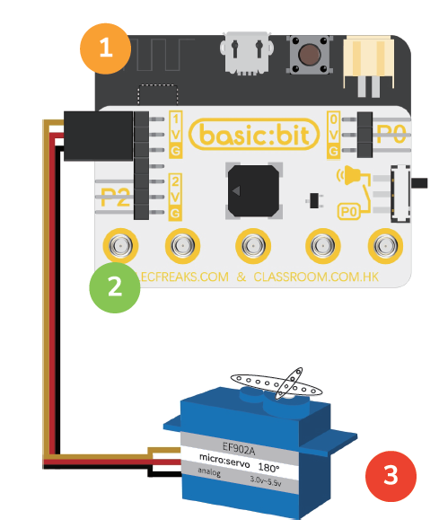
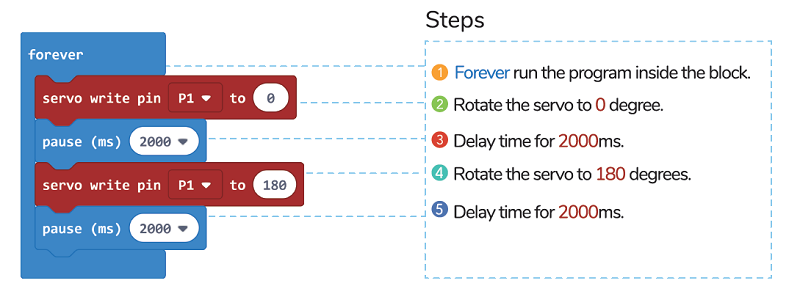

# Case 05: Servo

## Purpose
---
- In this project, you will learn how to make the servo rotate within its travel range.

## Materials 
---
* 1 x micro:bit
* 1 x [Basic : bit](https://www.elecfreaks.com/store)
* 1 x Servo

## Software Platform 
---
[MicroSoft makecode](https://makecode.microbit.org/#)

## Hardware connect

## Programming
---
### Program annotation

### Programming 

Links: [https://makecode.microbit.org/_he3KY49tdLAj](https://makecode.microbit.org/_he3KY49tdLAj)

You can also download it directly below:

<iframe style="position:absolute;top:0;left:0;width:100%;height:100%;" src="https://makecode.microbit.org/#pub:https://makecode.microbit.org/_he3KY49tdLAj" frameborder="0" sandbox="allow-popups allow-forms allow-scripts allow-same-origin">
</iframe>

  
---

## Result
---
* The servo is rotating among 0~180 degress.

## Exploration
---
* How to make a pointer thermometer with servo?

## FAQ
---
## Relevant Files
---