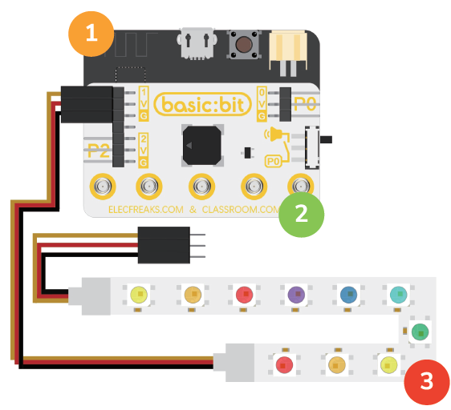
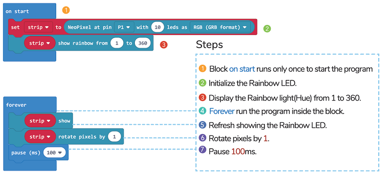

# Case 06: Rainbow LED

## Purpose
---
- In this project, you will learn how to use and control the Rainbow LED.

## Materials 
---
* 1 x micro:bit
* 1 x [Basic : bit](https://www.elecfreaks.com/store)
* 1 x Rainbow LED

## Software Platform 
---
[MicroSoft makecode](https://makecode.microbit.org/#)

## Hardware connect

## Programming
---
### Program annotation

### Programming 

Links: [https://makecode.microbit.org/_DfEHiCgzdXYk](https://makecode.microbit.org/_DfEHiCgzdXYk)

You can also download it directly below:

<iframe style="position:absolute;top:0;left:0;width:100%;height:100%;" src="https://makecode.microbit.org/#pub:https://makecode.microbit.org/_DfEHiCgzdXYk" frameborder="0" sandbox="allow-popups allow-forms allow-scripts allow-same-origin">
</iframe>

  
---

## Result
---
* The Rainbow LED display th rainbow mode.

## Exploration
---
* How to adjust the brightness of the Rainbow LED through the A/B button on the micro:bit?
## FAQ
---
## Relevant Files
---