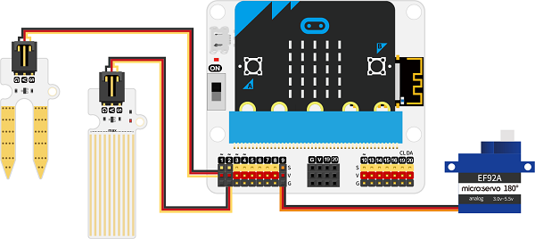
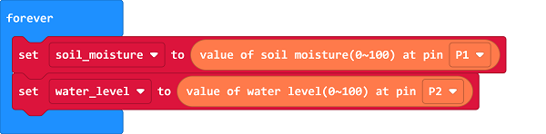
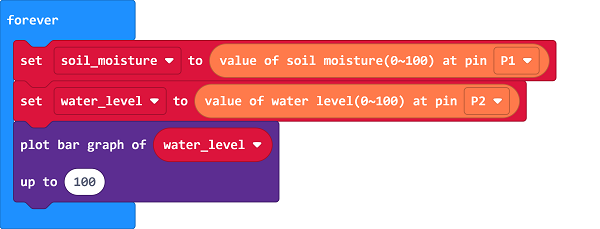

# Case 01: Auto Irrigation in Farmlands

##  Introduction
---

- The usual irrigation method to crops is in manual by hands, which has a low ultilization rates of water. Thus, we could make an auto irrigation device for farmlands. 

##  Function
---

- Detect the moisture of the soil from the soil moisture sensor and water it automatically if the value is less than the threhold, detect the water level in the container with the water level sensor and display its status on micro:bit. 

## Products Link
---
- 1 x [microbit Smart Agriculture Kit]()

## Picture
---

## Hardware Connection
---

Connect the soil moisture sensor to P1,  the water level sensor to P2 and the servo to P9 on IoT:bit. 

## Software Programming 

---

Click "Advanced" in the MakeCode to see more choices.

For programming, we need to add a package: click "Extensions" at the bottom of the MakeCode drawer and search with "iot-environment-kit" in the dialogue box to download it. 

Notice: If you met a tip indicating that some codebases would be deleted due to incompatibility, you may continue as the tips say or create a new project in the menu. 

## Program
---
Save the returned value from the soil moisture sensor and the water level sensor as the variable “soil_moisture” and the variable “water_level”.

Display the value of the water level in the form of the bar graph on the micro:bit. 

If the varible “soil_moisture is below the threshold, it means the moisture of the soil is in a low status, program to drive the servo for watering; or program to drive the servo for closing the valve. 

Link: [https://makecode.microbit.org/_awoUMcbKA0Ct](https://makecode.microbit.org/_awoUMcbKA0Ct)

<iframe style="position:absolute;top:0;left:0;width:100%;height:100%;" src="https://makecode.microbit.org/#pub:https://makecode.microbit.org/_awoUMcbKA0Ct)" frameborder="0" sandbox="allow-popups allow-forms allow-scripts allow-same-origin">
</iframe>

  

## Result
---
- Detect the moisture of the soil from the soil moisture sensor and water it automatically if the value is less than the threhold, detect the water level in the container with the water level sensor and display its status on micro:bit. 
