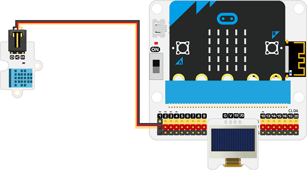
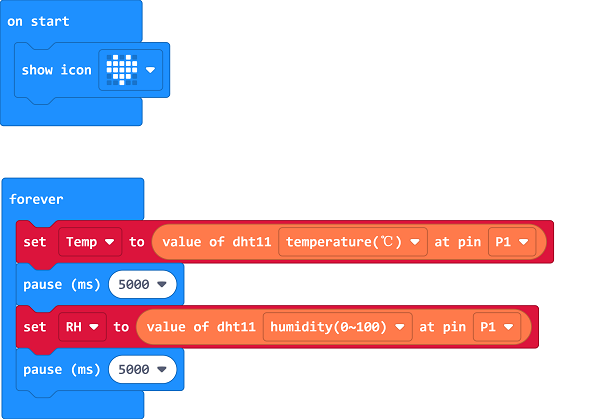
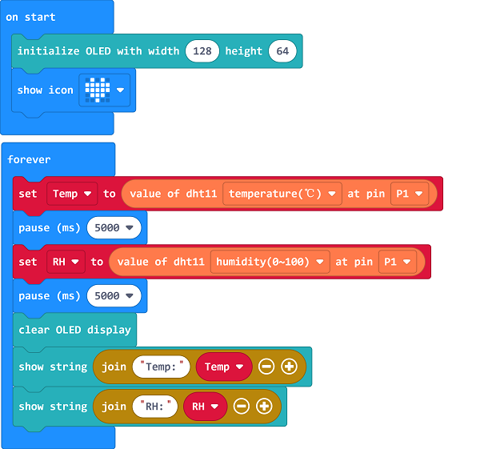

# Case 02: Temp.&Humidity Monitoring in the Greenhouse

##  Introduction
---

- Different plants require different temperture and humidity to grow, we can make a monitoring device for greenhouses to get the temperature and humidity. 

##  Function
---
- Detect the temperature and humidity from the DHT11 sensor and display them on the OLED screen. 

## Products Link
---
- 1 x [microbit Smart Agriculture Kit](https://shop.elecfreaks.com/products/elecfreaks-micro-bit-smart-agriculture-kit-without-micro-bit-board?_pos=2&_sid=2c86b7764&_ss=r)

## Picture
---

## Hardware Connection
---

Connect the DHT11 sensor to P1 and the OLED display to IIC on IoT:bit. 

## Software Programming 

---

Click "Advanced" in the MakeCode to see more choices.

For programming, we need to add a package: click "Extensions" at the bottom of the MakeCode drawer and search with "iot-environment-kit" in the dialogue box to download it. 

***Notice:*** If you met a tip indicating that some codebases would be deleted due to incompatibility, you may continue as the tips say or create a new project in the menu. 

## Program

---

Drag the on start block from drawer and show an icon, save the returned value of the temperature as the variable “Temp" and the humidity as the variable “RH”, as there is a 3-sec interval between getting the value of temperature and humidity, we need to add a 5-sec pause here. 

Initialize the OLED screen and display the returned value on it. 

Link: [https://makecode.microbit.org/_hT5JjX0JDWqV](https://makecode.microbit.org/_hT5JjX0JDWqV)

<iframe style="position:absolute;top:0;left:0;width:100%;height:100%;" src="https://makecode.microbit.org/#pub:https://makecode.microbit.org/_hT5JjX0JDWqV" frameborder="0" sandbox="allow-popups allow-forms allow-scripts allow-same-origin">
</iframe>

  

## Result
---
- The current temperature and humidity values display on the OLED screen.

