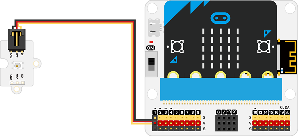
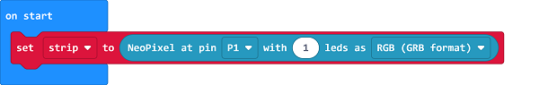
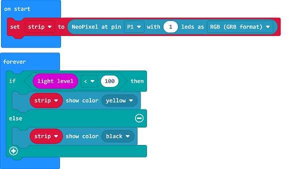

# Case 03: Artificial Light for Agriculture

##  Introduction
---

- In order to improve the crop yield, we could take measures such as prolonging the lighting time, making rational close planting,  adding the concentration of the CO2 and ect., here we can make an artificial light device to give enough light to crops automatically. 

##  Function
---
- Detect the ambient light intensity with the micro:bit, and turn on the light automatically if the light intensity is too weak. 

## Products Link
---
- 1 x [microbit Smart Agriculture Kit]()

## Picture
---

## Hardware Connection
---

Connect the rainbow LED to P1 port on IoT:bit. 

## Software Programming 

---

Click "Advanced" in the MakeCode to see more choices.

For programming, we need to add a package: click "Extensions" at the bottom of the MakeCode drawer and search with "neopixel" in the dialogue box to download it. 

Notice: If you met a tip indicating that some codebases would be deleted due to incompatibility, you may continue as the tips say or create a new project in the menu. 

## Program

---

Drag the on start block from the drawer, initialize the strip connecting to P1 with 1 led. 

Judge if the light level is below 100, if yes, program to light on; or turn it off. 

Link: [https://makecode.microbit.org/_Pzv57whfMgPa](https://makecode.microbit.org/_Pzv57whfMgPa)

<iframe style="position:absolute;top:0;left:0;width:100%;height:100%;" src="https://makecode.microbit.org/#pub:https://makecode.microbit.org/_Pzv57whfMgPa" frameborder="0" sandbox="allow-popups allow-forms allow-scripts allow-same-origin">
</iframe>

  

## Result
---
- Detect the ambient light intensity with the micro:bit, if the light intensity is too weak, turn on the light automatically ; or it turns off. 

