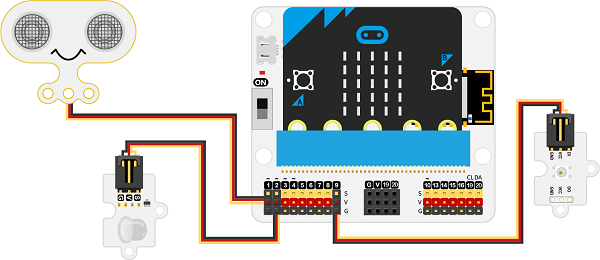
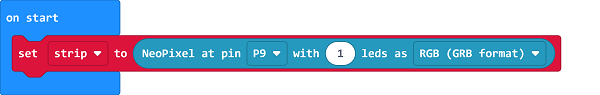
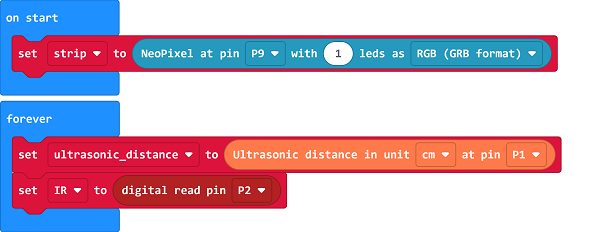
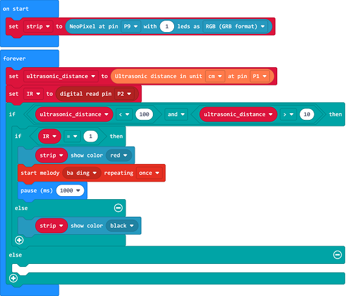

# Case 04: Farmlands Protection Device

##  Introduction
---

- In order to protect the farmlands from people to get in, we can set a farmland protection device. 

##  Function 
---
- Detect if there is any people approaching with the PIR sensor and Sonar:bit,  if yes, program to remind people of not coming by lighting on the rainbow LED. 

## Products Link
---
- 1 x [microbit Smart Agriculture Kit]()

## Picture
---

## Hardware Connection
---

Connect the Sonar:bit to P1, the PIR sensor to P2 and the rainbow LED to P9 on IoT:bit. 

## Software Programming 

---

Click "Advanced" in the MakeCode to see more choices.

For programming, we need to add a package: click "Extensions" at the bottom of the MakeCode drawer and search with "iot-environment-kit" in the dialogue box to download it. 

***Notice:*** If you met a tip indicating that some codebases would be deleted due to incompatibility, you may continue as the tips say or create a new project in the menu. 

## Program

---

Drag the on start block from the drawer, initialize the strip connecting to P9 with 1 led. 

Set to connect the sonar:bit to P1 with unit "cm" and the PIR sensor to P2, save the returned values as the variable "ultrasonic_distance" and the variable "IR" accordingly. 

Judge if the variable "ultrasonic_distance" is in the threshold, if yes, judge if the variable "IR" is 1, if yes, set the strip to show red and the buzzer to alarm; or turn the lights off. 

If the variable "ultrasonic_distance" is not in the threshold, program to turn off it light. 

Link: [https://makecode.microbit.org/_gDhV67AceFJw](https://makecode.microbit.org/_gDhV67AceFJw)

<iframe style="position:absolute;top:0;left:0;width:100%;height:100%;" src="https://makecode.microbit.org/#pub:https://makecode.microbit.org/_gDhV67AceFJw" frameborder="0" sandbox="allow-popups allow-forms allow-scripts allow-same-origin">
</iframe>

  

## Result
---
- If the device detects any people coming to the farmlands, the red light turns on and the buzzer alarms. 

