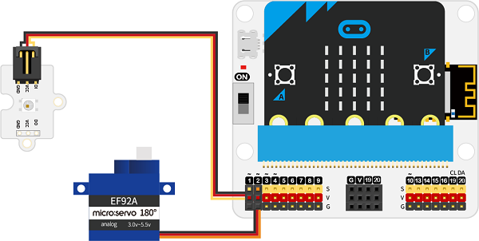
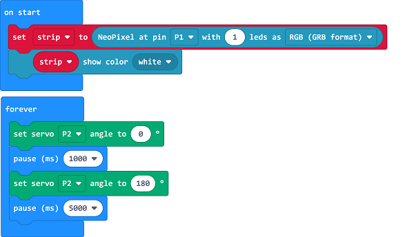

# 自动捕虫装置

##  简介
---
 
- 农业种植中，虫害问题影响产量，影响作物的质量。害虫都是晚上活跃，对农作物的啃噬、产卵繁殖也都是晚上进行。所以我们可以利用害虫的趋光性，制作一个自动捕虫装置，通过灯光吸引害虫并消灭它们。

##  功能
---
- 通过LED灯吸引害虫靠近，并通过舵机转动将害虫消灭。

## 购买链接
---
- 1 x [microbit Smart Agriculture Kit]()

## 产品图片
---

## 硬件链接
---

将彩虹灯连接到IOT:bit的P1端口，舵机连接到IOT:bit的P2端口。

## 软件编程
---
在MakeCode的代码抽屉中点击“高级”，查看更多代码选项。

为了给彩虹灯编程，我们需要添加一个扩展库。在代码抽屉底部找到“扩展”，并点击它。这时会弹出一个对话框，搜索”neopixel“，然后点击下载这个代码库。

为了给舵机编程，我们需要添加一个扩展库。在代码抽屉底部找到“扩展”，并点击它。这时会弹出一个对话框，搜索”servo“，然后点击下载这个代码库。

*注意：*如果你得到一个提示说一些代码库因为不兼容的原因将被删除，你可以根据提示继续操作，或者在项目菜单栏里面新建一个项目。

## 程序
---

当开机时初始化彩虹灯连接到P1端口，设置为1颗灯，并设置为白色灯光。

在无限循环中设置连接到P2端口的舵机转动到0度，延迟一秒后转动到180度，再延迟5秒。

请参考程序连接：[https://makecode.microbit.org/_ae72379ieU5W](https://makecode.microbit.org/_ae72379ieU5W)

<iframe style="position:absolute;top:0;left:0;width:100%;height:100%;" src="https://makecode.microbit.org/#pub:https://makecode.microbit.org/_ae72379ieU5W" frameborder="0" sandbox="allow-popups allow-forms allow-scripts allow-same-origin">
</iframe>

  

## 结果
---
- 装置启动后亮白灯，每隔五秒则舵机转动一次。

