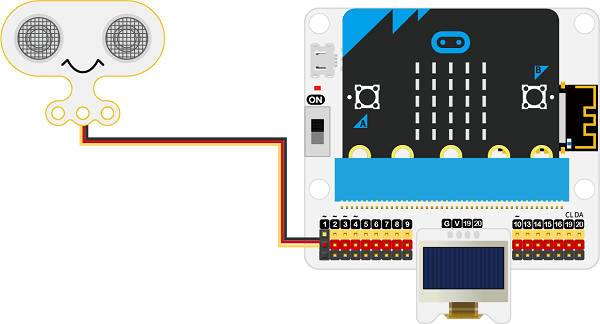
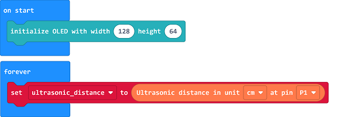
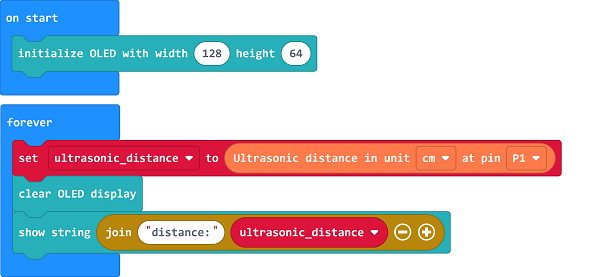

# 农作物高度检测

##  简介
---
 
- 农作物植株高度是决定作物产量的重要因素，降低植株高度能够增加植株耐肥和抗倒伏能力，并提高收获指数和最终产量，这也充分说明了植株高度是育种过程中一个重要选择指标。

##  功能
---
- 通过超声波传感器检测植株高度是否超标。

## 购买链接
---
- 1 x [microbit Smart Agriculture Kit]()

## 产品图片
---

## 硬件链接
---

将超声波传感器连接到IOT:bit的P1端口，OLED显示屏连接到IOT:bit的IIC端口。

## 软件编程
---
在MakeCode的代码抽屉中点击“高级”，查看更多代码选项。

为了给microbit Smart City Kit编程，我们需要添加一个扩展库。在代码抽屉底部找到“扩展”，并点击它。这时会弹出一个对话框，搜索”iot-environment-kit“，然后点击下载这个代码库。

*注意：*如果你得到一个提示说一些代码库因为不兼容的原因将被删除，你可以根据提示继续操作，或者在项目菜单栏里面新建一个项目。

## 程序
---

当开机时初始化OLED显示屏为128×64。

设置超声波传感器连接到P1端口，测距单位为cm，并保存返回值到变量“ultrasonic_distance”中。

清空OLED显示屏的显示内容，显示当前超声波检测数据。

判断超声波检测数据是否出现在设定阈值内的数据，如果是，则证明有植株高度超过限制，设置LED矩阵显示×图标，否则设置LED矩阵显示√图标。

请参考程序连接：[https://makecode.microbit.org/_4rfVpw74kVdW](https://makecode.microbit.org/_4rfVpw74kVdW)

<iframe style="position:absolute;top:0;left:0;width:100%;height:100%;" src="https://makecode.microbit.org/#pub:https://makecode.microbit.org/_4rfVpw74kVdW" frameborder="0" sandbox="allow-popups allow-forms allow-scripts allow-same-origin">
</iframe>

  

## 结果
---
- 通过超声波传感器检测植株高度是否超标。

