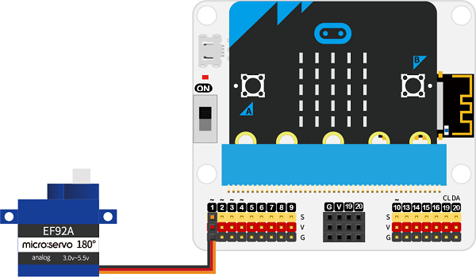
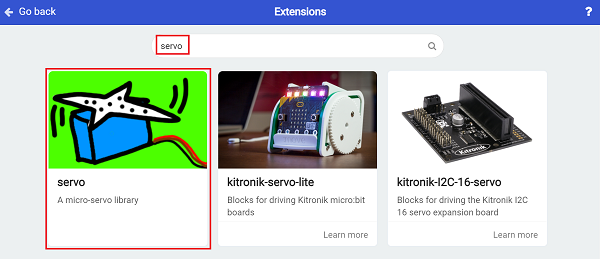
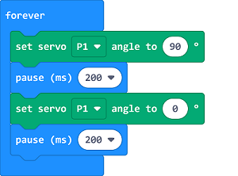

# Case 08: Auto Pick-up Device

##  Introduction
---

- In the normal pick-up of the nut fruits, we usually use a stick to chop the branches to get the mature fruits, which could do a bad harm to the leaves and branches,thus, we can make an auto pick-up device by shaking the trunk of the tree. 

##  Function
---
- Shake the trunk of the tree to get the fruits. 

## Products Link
---
- 1 x [microbit Smart Agriculture Kit]()

## Picture
---

## Hardware Connection
---

Connect the servo to P1 on IoT:bit. 

## Software Programming 

---

Click "Advanced" in the MakeCode to see more choices.

For programming, we need to add a package: click "Extensions" at the bottom of the MakeCode drawer and search with "servo" in the dialogue box to download it. 

Notice: If you met a tip indicating that some codebases would be deleted due to incompatibility, you may continue as the tips say or create a new project in the menu. 

## Program

---

Set the servo to drive to 90°, pause for 200ms, then set it to drive to 0° and pause another 200ms. 

Link: [https://makecode.microbit.org/_EdPD6HckVEuE](https://makecode.microbit.org/_EdPD6HckVEuE)

<iframe style="position:absolute;top:0;left:0;width:100%;height:100%;" src="https://makecode.microbit.org/#pub:https://makecode.microbit.org/_EdPD6HckVEuE" frameborder="0" sandbox="allow-popups allow-forms allow-scripts allow-same-origin">
</iframe>

  

## Result
---
- Shake the trunk via the servo to pick up the fruits. 

