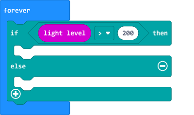
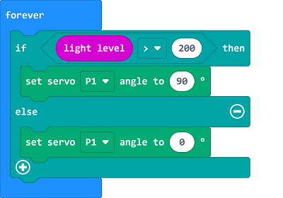

# 农作物遮阳装置

##  简介
---
 
- 虽然植物的生长依赖光合作用。但光照过强亦对植物造成生理伤害，在光照过强时易发生叶烧或者日灼，所以我们可以制作一个农作物遮阳装置。

##  功能
---
- 通过micro:bit上的亮度级别检测功能检测当前环境光强度，如果环境光强度过高，则通过舵机升起遮阳装置。

## 购买链接
---
- 1 x [microbit Smart Agriculture Kit]()

## 产品图片
---

## 硬件链接
---

将舵机连接到IOT:bit的P1端口。

## 软件编程
---
在MakeCode的代码抽屉中点击“高级”，查看更多代码选项。

为了给舵机编程，我们需要添加一个扩展库。在代码抽屉底部找到“扩展”，并点击它。这时会弹出一个对话框，搜索”servo“，然后点击下载这个代码库。

*注意：*如果你得到一个提示说一些代码库因为不兼容的原因将被删除，你可以根据提示继续操作，或者在项目菜单栏里面新建一个项目。

## 程序
---

在无限循环中，判断亮度级别是否大于200。

如果亮度级别大于200，则设置舵机转动到90度，否则设置舵机转动到0度。

请参考程序连接：[https://makecode.microbit.org/_hctVTMDirM8x](https://makecode.microbit.org/_hctVTMDirM8x)

<iframe style="position:absolute;top:0;left:0;width:100%;height:100%;" src="https://makecode.microbit.org/#pub:https://makecode.microbit.org/_hctVTMDirM8x" frameborder="0" sandbox="allow-popups allow-forms allow-scripts allow-same-origin">
</iframe>

  

## 结果
---
- 当亮度级别过高时，自动升起遮阳装置，防止农作物出现叶烧、日灼的情况。

