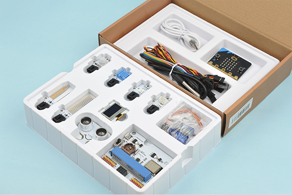
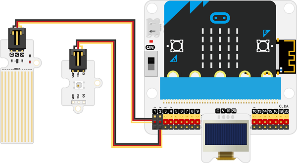
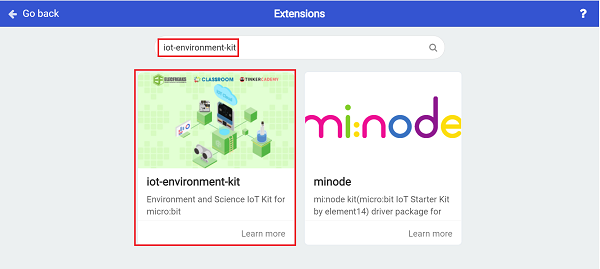
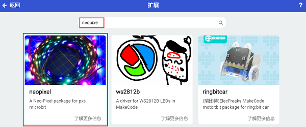
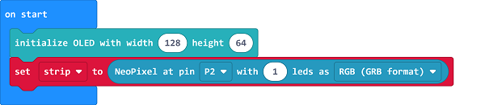
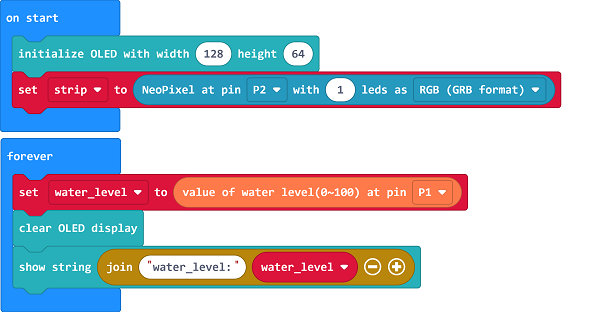
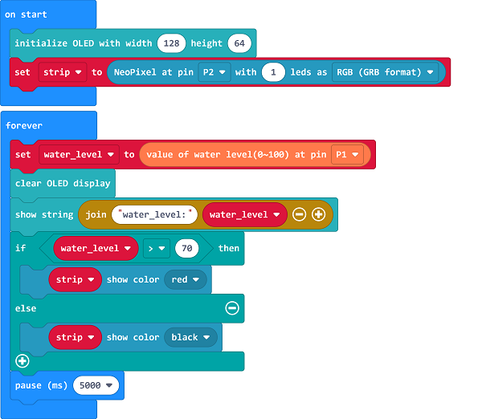

# Case 10: Water Level Monitoring in Fish Ponds 

##  Introduction
---

- When encountering heavy rain, the water level of the fish pond may rise sharply, and the fish may escape from the fish pond.

##  Function
---
- Monitor the water level of the fish pond with the water level sensor and display the current water level value on OLED screen, proram to light on the LED in red if the water level is too high. 

## Products Link
---
- 1 x [microbit Smart Agriculture Kit](https://www.elecfreaks.com/micro-bit-smart-agriculture-kit-without-micro-bit-board.html)

## Picture
---

## Hardware Connection
---

Connect the water level sensor to P1, the rainbow LED to P2 and the OLED to IIC on IoT:bit. 

## Software Programming 

---

Click "Advanced" in the MakeCode to see more choices.

For programming, we need to add a package: click "Extensions" at the bottom of the MakeCode drawer and search with "iot-environment-kit" in the dialogue box to download it. 

For programming, we need to add a package: click "Extensions" at the bottom of the MakeCode drawer and search with "neopixel" in the dialogue box to download it. 

***Notice:*** If you met a tip indicating that some codebases would be deleted due to incompatibility, you may continue as the tips say or create a new project in the menu. 

## Program

---
In the on start block, initialize the OLED display and set the rainbow LED connecting to P2 with 1 led. 

Save the returned value from the water level sensor connecting to P1 as the variable "water_level" and display the value on OLED screen. 

Judge if the current value is over the threshold, if yes, program to light on the LED in red. 

Link: [https://makecode.microbit.org/_dHJDqwUoDDTf](https://makecode.microbit.org/_dHJDqwUoDDTf)

<iframe style="position:absolute;top:0;left:0;width:100%;height:100%;" src="https://makecode.microbit.org/#pub:https://makecode.microbit.org/_dHJDqwUoDDTf" frameborder="0" sandbox="allow-popups allow-forms allow-scripts allow-same-origin">
</iframe>

  

## Result
---
- The current water level value displays on the OLED screen, if it is too high, the rainbow LED lights on in red for reminding. 

