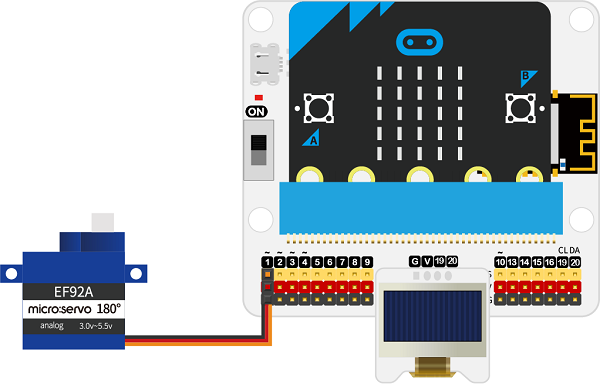
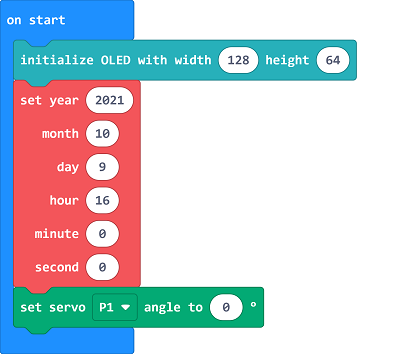
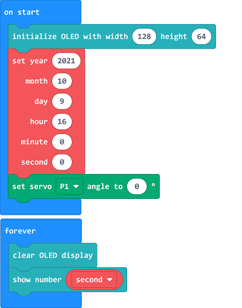
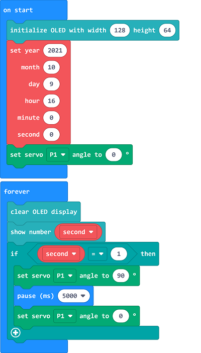

# Case 11: Feed at Fixed Time

##  Introduction
---

- Feeding animals in manual is not convenient, we can make a device that could feed them at fixed time. 

##  Function
---
- Make the timing with RTC module and program to drive the servo for feeding at the fixed time. 

## Products Link
---
- 1 x [microbit Smart Agriculture Kit]()

## Picture
---

## Hardware Connection
---

Connect the servo to P1, and the OLED to IIC on IoT:bit. 

## Software Programming 

---

Click "Advanced" in the MakeCode to see more choices.

For programming, we need to add a package: click "Extensions" at the bottom of the MakeCode drawer and search with "iot-environment-kit" in the dialogue box to download it. 

For programming, we need to add a package: click "Extensions" at the bottom of the MakeCode drawer and search with "neopixel" in the dialogue box to download it. 

Notice: If you met a tip indicating that some codebases would be deleted due to incompatibility, you may continue as the tips say or create a new project in the menu. 

## Program

---

Initialize the OLED display as 128×64m and the time settings of RTC module, set the sevo to drive to 0°.

Display the current seconds on OLED screen. 

If the second is 1, set the servo to drive to 90°, pause 5000ms and then set the servo to drive to 0°. 

Link: [https://makecode.microbit.org/_RE7cgtJCJMFP](https://makecode.microbit.org/_RE7cgtJCJMFP)

<iframe style="position:absolute;top:0;left:0;width:100%;height:100%;" src="https://makecode.microbit.org/#pub:https://makecode.microbit.org/_RE7cgtJCJMFP" frameborder="0" sandbox="allow-popups allow-forms allow-scripts allow-same-origin">
</iframe>

  

## Result
---
- The device makes the feeding every 1 minute. 
