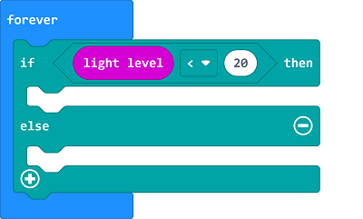
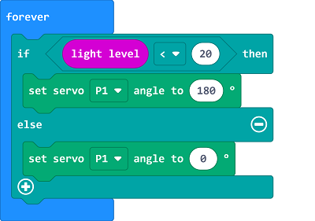

# 防止鸟撞装置

##  简介
---
 
- 鸟撞建筑或鸟撞玻璃指鸟类因玻璃透明与反光的特性无法辨认出玻璃的存在，从而与建筑尤其是玻璃窗户相撞，导致鸟类受伤或死亡。鸟撞建筑是鸟类面临的最严重的威胁之一，并被认为是重要的鸟类保护课题。其中一条预防措施就是在晚上关闭不必要的灯光或者拉上窗帘。因为在夜晚，玻璃附近的装饰性光亮会让迁徙中的鸟迷失方向，导致它们和摩天大楼，办公楼或者其他装饰着灯光的玻璃撞击。所以我们可以设计一个自动拉上窗帘的装置，减少灯光干扰。

##  功能
---
- 通过micro:bit上的亮度级别检测功能检测当前环境光强度，如果环境光强度低于设定阈值，则通过舵机放下窗帘。

## 购买链接
---
- 1 x [microbit Smart Agriculture Kit]()

## 产品图片
---

## 硬件链接
---

将舵机连接到IOT:bit的P1端口。

## 软件编程
---
在MakeCode的代码抽屉中点击“高级”，查看更多代码选项。

为了给舵机编程，我们需要添加一个扩展库。在代码抽屉底部找到“扩展”，并点击它。这时会弹出一个对话框，搜索”servo“，然后点击下载这个代码库。

*注意：*如果你得到一个提示说一些代码库因为不兼容的原因将被删除，你可以根据提示继续操作，或者在项目菜单栏里面新建一个项目。

## 程序
---

在无限循环中，判断当前环境亮度级别是否低于20。

当环境亮度级别小于20时，则设置连接到P1端口的舵机转动到180度，否则设置连接到P1端口的舵机转动到0度。

请参考程序连接：[https://makecode.microbit.org/_dHgWHFfYvgTR](https://makecode.microbit.org/_dHgWHFfYvgTR)

<iframe style="position:absolute;top:0;left:0;width:100%;height:100%;" src="https://makecode.microbit.org/#pub:https://makecode.microbit.org/_dHgWHFfYvgTR" frameborder="0" sandbox="allow-popups allow-forms allow-scripts allow-same-origin">
</iframe>

  

## 结果
---
- 当环境光强度低于设定阈值时，则通过舵机放下窗帘。

