# The Smart Farm

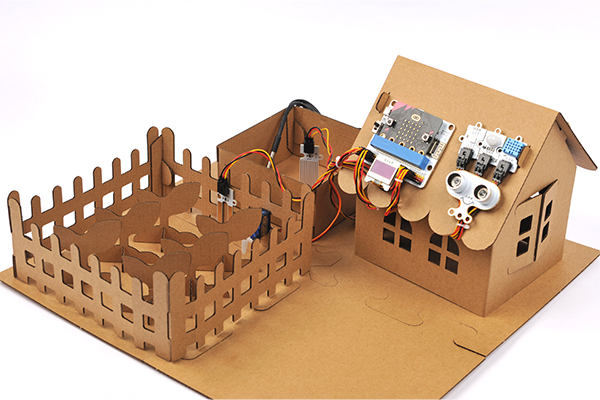

##  Introduction

To build a smart farm with the Smart Agriculture Kit and the Carton models. 

##  Functions

- Auto-irrigation: Control the movement of the servos with the level of the soil moisture. 
    Reference: [Auto Irrigation in Farmlands](https://www.elecfreaks.com/learn-en/microbitKit/smart_agriculture_kit/microbit-Smart-Agriculture-Kit-case-01.html)
- Temperature and Humidity Detection: Detect and display the value of the temperature and humidity in the farm. 
    Reference: [Temp.&Humidity Monitoring in the Greenhouse](https://www.elecfreaks.com/learn-en/microbitKit/smart_agriculture_kit/microbit-Smart-Agriculture-Kit-case-02.html)
- Fish ponds detection: Monitor the water level and display the water temperature. 
    Reference: [Water Level Monitoring in Fish Ponds](https://www.elecfreaks.com/learn-en/microbitKit/smart_agriculture_kit/microbit-Smart-Agriculture-Kit-case-10.html) 、[Water Temperature Detection](hhttps://www.elecfreaks.com/learn-en/microbitKit/smart_agriculture_kit/microbit-Smart-Agriculture-Kit-case-05.html)
- Farmland protection device: Protect the farmlands from people to get in, set to flash the lights when people get close for warning. 
    Reference: [Farmlands Protection Device](https://www.elecfreaks.com/learn-en/microbitKit/smart_agriculture_kit/microbit-Smart-Agriculture-Kit-case-04.html)

## Materials Required

Smart Agriculture Kit

Link: [https://www.elecfreaks.com/micro-bit-smart-agriculture-kit-without-micro-bit-board.html](https://www.elecfreaks.com/micro-bit-smart-agriculture-kit-without-micro-bit-board.html)

Smart Agricultural Carton Model

Link: 

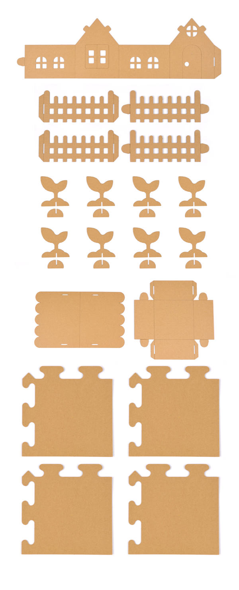

Double-sided tapes: Fix the sensors and the postion of the models. 

## Assembly

Step 1: Take out the cardboards and splice the baseboard. 

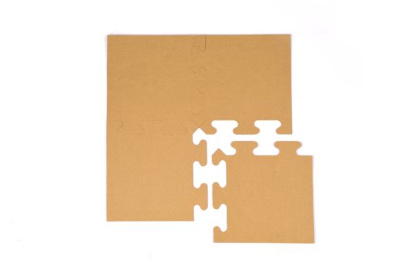

Step 2: Fold the cardboards with the crease and fasten the buckles. 

Finished models after the assembly

1. The baseboard 
  
  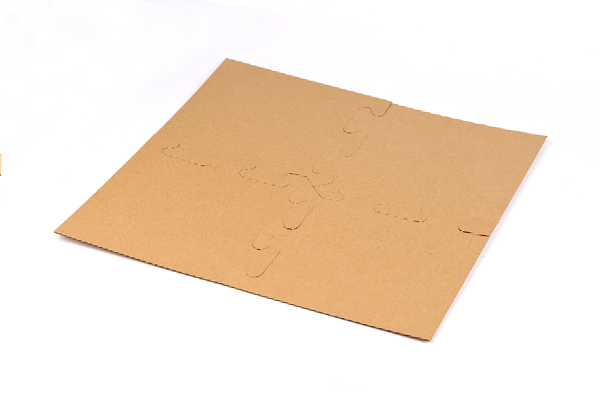
  
2. The fish pond
  
  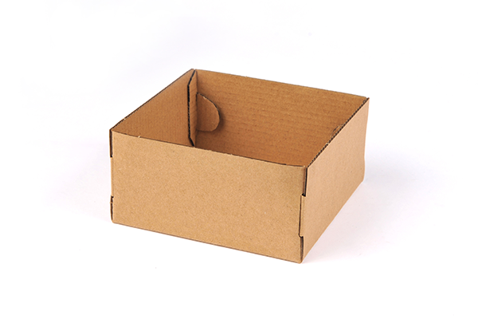
  
3. The cabbin
  
  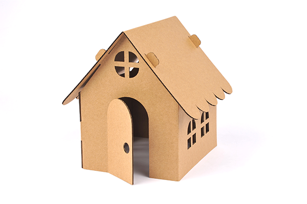
  
4. The fence
  
  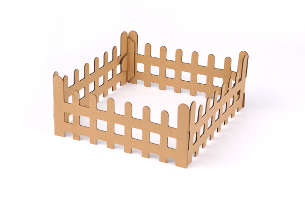
  
5. The plant
  
  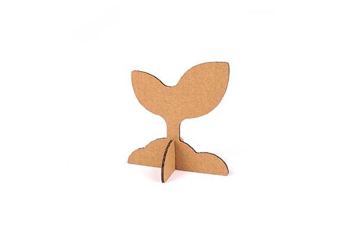

Step 3: Put the models on the baseboard

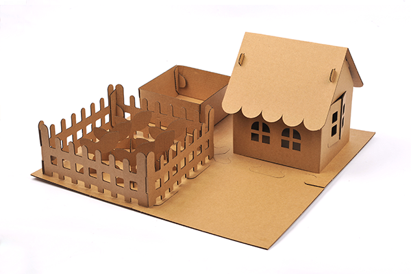

Tip: Please can glue the models with the double-sided tapes. 

## Hardware Connections 

Connect the soil moisture sensor to P1 on IoT:bit; 
the 180 degrees servo to P2; 
the DHT 11 to P3;
the rainbow LED to P4;
the water level sensor to P10;
the DS18B20 sensor to P13;
the infrared sensor to P14;
the sonar:bi to P15;
and the OLED display to IIC on Iot:bit. 

## Add Extensions
Click the "Advanced" in the MakeCode drawer to see more choices. 

For programming, we need to add a package: click "Extensions" at the bottom of the MakeCode drawer and search with "servo" in the dialogue box to download it. 

For programming, we need to add a package: click "Extensions" at the bottom of the MakeCode drawer and search with "neopixel" in the dialogue box to download it. 

For programming, we need to add a package: click "Extensions" at the bottom of the MakeCode drawer and search with "iot-environment-kit" in the dialogue box to download it. 

## Programming

Initialize the OLED screen and disable the LED functions on the micro:bit, initialize the rainbow LED. 

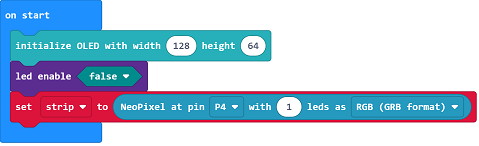

Get the values from all sensors and display them on the OLED screen. 

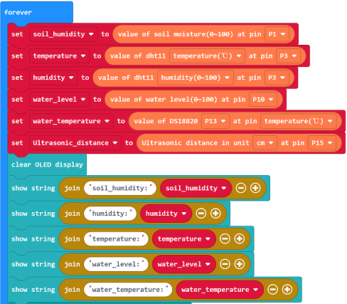

If the returned value from the soil moisture is below the threshold, make the servo rotate to 0 degree to simulate the opening of the water valve; or make it rotate to 180 degrees to simulate the closing of the water valve. 

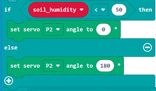

If there is any obstables detected among 4~400cm by the sonar:bit, detect if there is any movement with the infrared sensor, if yes, program to light on the red light or program to light on in green. 

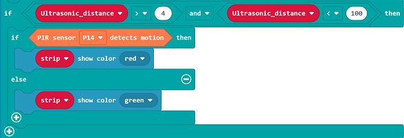

Code:

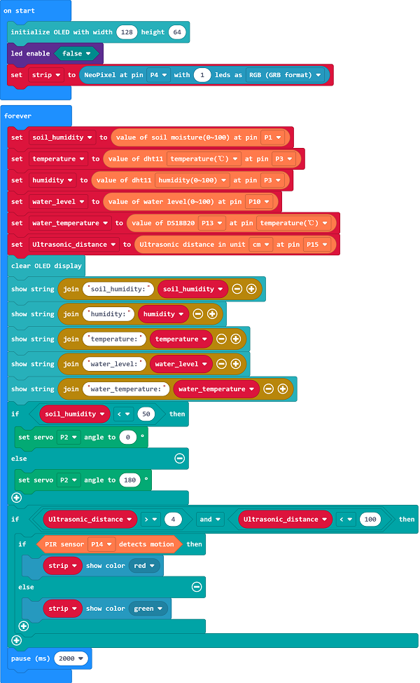

Reference link: [https://makecode.microbit.org/_eYRf5hcaDEeR](https://makecode.microbit.org/_eYRf5hcaDEeR)

<iframe style="position:absolute;top:0;left:0;width:100%;height:100%;" src="https://makecode.microbit.org/#_eYRf5hcaDEeR" frameborder="0" sandbox="allow-popups allow-forms allow-scripts allow-same-origin">
</iframe>

  

##  Result
The values of the soil moisture, the temperature and humidity of the farmland, the water level and the water temperature shall be displayed on the OLED screen. 
If the value of the soil moisture is below the threshold, the device would turn on the water valve for irrigating; or it's in the close status to save water. 
If there is any one getting closer, the rainbow LED lights on in red for warning; or it light on in green. 

**Tip**: As the models are made of paper, please prepare with water-proofs solutions if your project needs water. For example: we can put a plastix box inside of the fish ponds for protection. 

