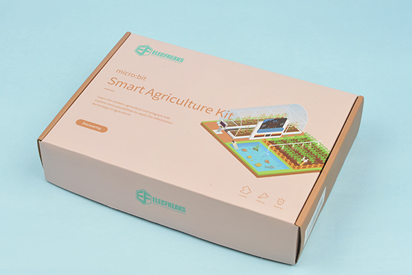

# micro:bit Smart Agriculture Kit

##  Introduction
---

- The micro:bit Smart Agriculture Kit has a well-selection of IoT:bit, DS18B20 temperature sensor, soil moisture sensor, water level sensor, PIR sensor, servos and etc., we could use it to build such themes as the smart insects repelling machine, the ecological greenhouse, the fish pond water level monitoring device and more, from which we can learn the modern agriculture and program and explore more possibilities to apply the information technology in agriculture.

## Components List

Modules|Qty.|Note
:-:|:-:|:-:
micro:bit|1|Optional
IoT:bit|1|-
OLED Screen|1|-
Rainbow LED|1|-
DHT11 Sensor|1|-
Sonar:bit|1|-
Soil Moisture Sensor|1|-
PIR Sensor|1|-
Water Level Sensor|1|-
DS18B20(Waterproof) Sensor|1|-
180° Servo|1|-
USB Cable|1|-
Manual Book|1|-