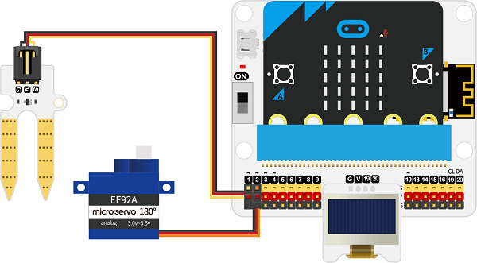
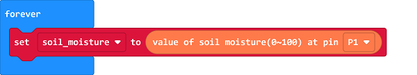
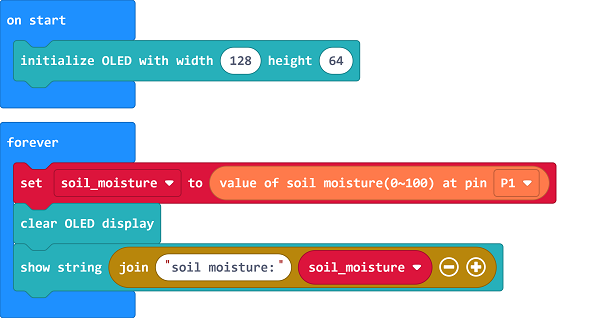
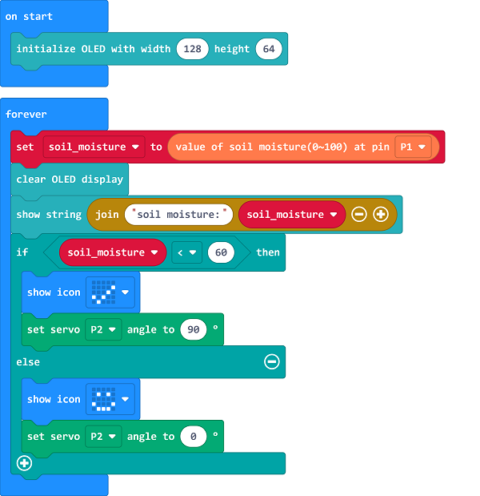

# Case 02: Auto Irrigation System 

##  Introduction
---

The environment protection has gained much focus nowadys, and the city landscapes have played an important role in the development. To satisfy the irrigation demands of the afforesting, the water consumming has soaring a lot with the manual irrigation, which may lead to the overuse of the warter resourse. Therefore, we could make an auto irrigation device to save both the water and the labor force. 

##  Function

---

Detect the moisture value of the soil from the soil moisture sensor and display it on the OLED screen, it waters automatically if the value is below the threshold that we set. 

## Products Link
---
- 1 x [microbit Smart City Kit]()

## Picture
---

## Hardware Connection 
---

Connect the soil moisture sensor to P1,  the servo to P2 and the OLED to IIC on IoT:bit. 

## Software Programming 

---

Click "Advanced" in the MakeCode to see more choices.

For programming, we need to add a package: click "Extensions" at the bottom of the MakeCode drawer and search with "iot-environment-kit" in the dialogue box to download it. 

For programming, we need to add a package: click "Extensions" at the bottom of the MakeCode drawer and search with "servo" in the dialogue box to download it. 

Notice: If you met a tip indicating that some codebases would be deleted due to incompatibility, you may continue as the tips say or create a new project in the menu. 

## Program 

---
Save the returned soil moisture value as the variable “soil_moisture”. 

Display the value on the OLED screen. 

If the “soil_moisture” value is below the threshold, it means the landscapes need to be watered, program to turn on the servo to water; or program to turn off to stop watering. 

Link: [https://makecode.microbit.org/_e36JXPW3r31t](https://makecode.microbit.org/_e36JXPW3r31t)

<iframe style="position:absolute;top:0;left:0;width:100%;height:100%;" src="https://makecode.microbit.org/#pub:https://makecode.microbit.org/_e36JXPW3r31t" frameborder="0" sandbox="allow-popups allow-forms allow-scripts allow-same-origin">
</iframe>

  

## Result
---
- The soil moisture value displays on the OLED, the water valve would be opened if the value is lower than the threshold or it turns off to save water. 

