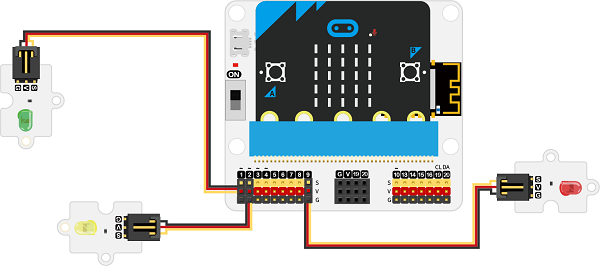
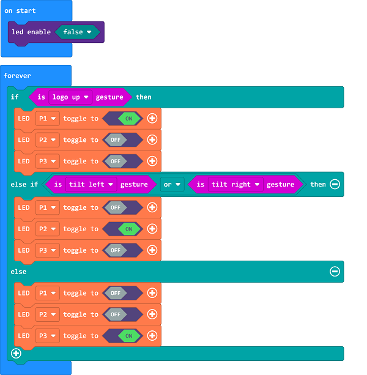

# Case 04: The Birds Nest 

##  Introduction
---

The human activities have changed a lot on the living environment of birds, the birds are not easy to find places to rest and food in cities, therefore, we could make a bird nest for them to live. 

## Function
---

Control the lighting of LEDs in different colors from the tilted status of the micro:bit to remind people of protecting the nests. 

## Products Link
---
- 1 x [microbit Smart City Kit](https://shop.elecfreaks.com/products/elecfreaks-micro-bit-smart-city-kit-without-micro-bit-board?_pos=1&_sid=ce30b50b6&_ss=r)

## Picture
---

## Hardware Connection 
---

Connect the green LED to P1,  the yellow to P2 and the red to P9 on IoT:bit. 

## Software Programming 

---

Click "Advanced" in the MakeCode to see more choices.

For programming, we need to add a package: click "Extensions" at the bottom of the MakeCode drawer and search with "iot-environment-kit" in the dialogue box to download it. 

***Notice:*** If you met a tip indicating that some codebases would be deleted due to incompatibility, you may continue as the tips say or create a new project in the menu. 

## Program
---

Turn on the lights in accordance with the micro:bit status, if the micro:bit logo faces upwards it means the nest is in a normal status with the green led turnning on; if the yellow led lights on, it means the micro:bit is in a tilted status which means the nest is tilting to the left/right side; or the red means the nest is upside down now and it requires a re-construction. 

Link: [https://makecode.microbit.org/_cCmX94iMVVvh](https://makecode.microbit.org/_cCmX94iMVVvh)

<iframe style="position:absolute;top:0;left:0;width:100%;height:100%;" src="https://makecode.microbit.org/#pub:https://makecode.microbit.org/_cCmX94iMVVvh" frameborder="0" sandbox="allow-popups allow-forms allow-scripts allow-same-origin">
</iframe>

  

## Result
---
- The nest is in a normal status if the green led is turnning on; if the yellow led lights on, it means the micro:bit is in a tilted status which means the nest is tilting to the left/right side; or the red means the nest is upside down now and it requires a re-construction. 

