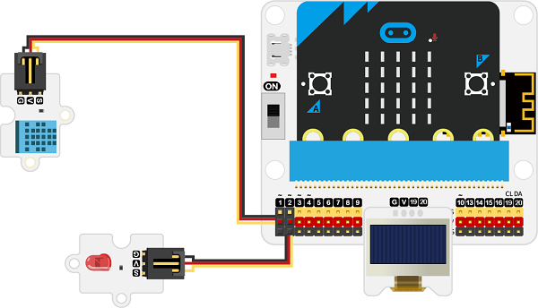
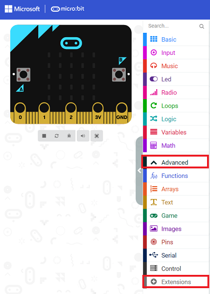
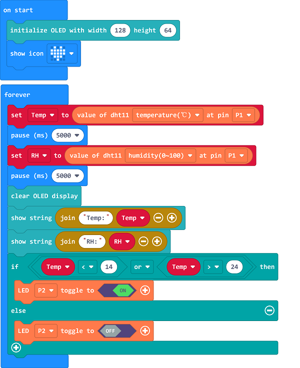

# Case 05: Temp.&Moisture Dectecion in the Library

##  Introduction
---

A stable temperature(among 14℃-24℃ ) and moisture(45%-60%) in the liabrary helps to protect the books from the breeding of the insects in high temperature and moisture environment or the brittleness growing in low temperature and moisture environment.

##  Function

---

Detect the temperature and moisture value from DHT11 sensor and display them on the OLED screen, if the values are not in the normal scope that we set, program to light on the LEDs for reminding. 

## Products Link
---
- 1 x [microbit Smart City Kit]()

## Picture
---

## Hardware Connection 
---

Connect the DHT11 sensor to P1,  the red LED to P2 and the OLED display to IIC on IoT:bit. 

## Software Programming 

---

Click "Advanced" in the MakeCode to see more choices.

For programming, we need to add a package: click "Extensions" at the bottom of the MakeCode drawer and search with "iot-environment-kit" in the dialogue box to download it. 

Notice: If you met a tip indicating that some codebases would be deleted due to incompatibility, you may continue as the tips say or create a new project in the menu. 

## Program
---

Drag the show icon in the on start block, save the returned temperature value as variable "Temp" and the moisture value as "RH", as there is a 3-sec interval between getting the value of temperature and moisture, we need to add a 5-sec pause here. 

Initialize the OLED screen and display the returned value on it. 

Judge if the current temperature is a proper value to preserve the books, if not, the red led lights on or it turns off. 

Judge if the current moisture is a proper value to preserve the books, if not, the red led lights on or it turns off. 

Link: [https://makecode.microbit.org/_01gdJmbcq65D](https://makecode.microbit.org/_01gdJmbcq65D)

<iframe style="position:absolute;top:0;left:0;width:100%;height:100%;" src="https://makecode.microbit.org/#pub:https://makecode.microbit.org/_01gdJmbcq65D" frameborder="0" sandbox="allow-popups allow-forms allow-scripts allow-same-origin">
</iframe>

  

## Result
---
- The current temperature and moisture values display on the OLED screen, if they are in the proper scopes, the red led turns off or it turns on. 

