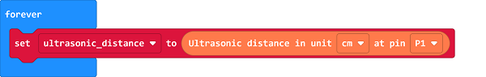
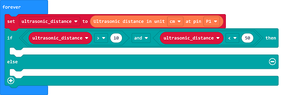
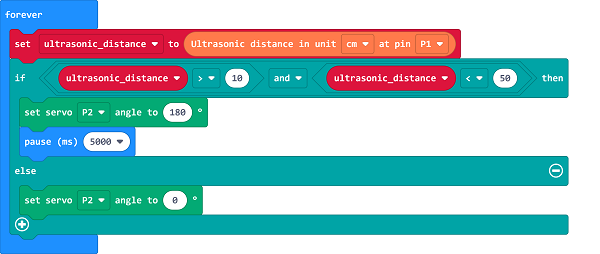

# Case 06: Auto Pets Feeder

##  Introduction
---

- A travelling plan is mostly made in holidays, it's a good choice but it could be concerned if we get our pets stayed at home in that period, if we could make a foods feeder for the pets during our holidays, it would be much helpful.  

## Functions

- Detect if there is any pet in the front of the feeder through the ultrasonic sound sensor, if yes, program to open the lid of the feeder and add food automatically. 

## Products Link
---
- 1 x [microbit Smart City Kit]()

## Picture
---

## Hardware Connection
---

Connect DHT11 sensor to P1, the red LED to P2 and the OLED display to IIC on IoT:bit. 

## Software Program
---
Click "Advanced" in the MakeCode drawer to see more choices. 

For programming, we need to add a package: click "Extensions" at the bottom of the MakeCode drawer and search with "iot-environment-kit" in the dialogue box to download it. 

For programming, we need to add a package: click "Extensions" at the bottom of the MakeCode drawer and search with "servo" in the dialogue box to download it. 

Notice: If you met a tip indicating that some codebases would be deleted due to incompatibility, you may continue as the tips say or create a new project in the menu. 

## Program

---

Save the returned value of the ultrasonic sound sensor as the variable “ultrasonic_distance”.

Judge if there is any pet in the front of the feeder by the returned value of the ultrasonic sonic sensor, note the effective detection range is 4~400cm, if the pet(other objects) is not in this scope, the returned value would be 0, thus, we need to give the maxium and minum value for the threshold. 

If the returned value is in the threshold scope, it means there is a pet in the front of the feeder, thus, program to drive the servos and give the good; or program to drive the servos to close it. 

Link: [https://makecode.microbit.org/_0fiexRbyoKpE](https://makecode.microbit.org/_0fiexRbyoKpE)

<iframe style="position:absolute;top:0;left:0;width:100%;height:100%;" src="https://makecode.microbit.org/#pub:https://makecode.microbit.org/_0fiexRbyoKpE" frameborder="0" sandbox="allow-popups allow-forms allow-scripts allow-same-origin">
</iframe>

  

## Result
---
- If there is any pet detected by the ultrasonic sound sensor, the feeder opens its lip and give out the food to pets. 

