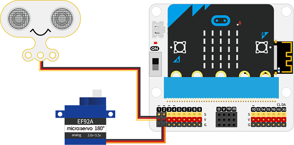
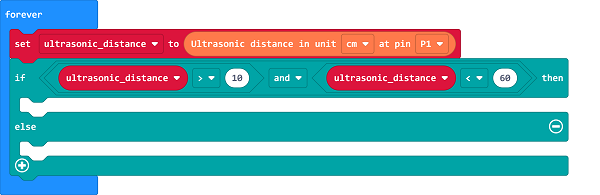
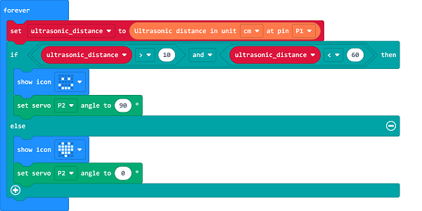

# Case 08: Auto Drinking Device

##  Introduction
---

- There are water dispensers on the roadside in cities, you only need to turn on the switch and it will flow out the drinking water. These devices can facilitate the citizens' drinking water demands in outdoors, thus we can make an automatic drinking device that can automatically flow out and drink without pressing the switch.

## Function
---

-  Detect if there is anyone in the front of the ultrasonic sound sensor, if yes, proram to drive the servo to open the switch. 

## Products Link
---
- 1 x [microbit Smart City Kit]()

## Picture
---

## Hardware Connection
---

Connect the sonar:bit to P1 and the servo to P2 port on IoT:bit. 

## Software Program

---

Click "Advanced" in the MakeCode drawer to see more choices. 

For programming, we need to add a package: click "Extensions" at the bottom of the MakeCode drawer and search with "iot-environment-kit" in the dialogue box to download it. 

For programming, we need to add a package: click "Extensions" at the bottom of the MakeCode drawer and search with "servo" in the dialogue box to download it. 

***Notice:*** If you met a tip indicating that some codebases would be deleted due to incompatibility, you may continue as the tips say or create a new project in the menu. 

## Program

---
Save the returned value of the of the ultrasonic sound sensor as the variable "ultrasonic_distance".

Judge if there is anyone approaching through the value of the "ultrasonic_distance", as the detection range of the of the ultrasonic sound sensor is 4~400cm, any detections not in this range should get a "0" as the returned value, thus, we need to set the max. and the min. value to the threshold. 

If the returned value is in the threshold, it means there is someone approaching to get water, program to drive the servo to open the water valve; or program to close it. 

Link: [https://makecode.microbit.org/_LP22ogi0t1KJ](https://makecode.microbit.org/_LP22ogi0t1KJ)

<iframe style="position:absolute;top:0;left:0;width:100%;height:100%;" src="https://makecode.microbit.org/#pub:https://makecode.microbit.org/_LP22ogi0t1KJ" frameborder="0" sandbox="allow-popups allow-forms allow-scripts allow-same-origin">
</iframe>

  

## Result
---
- If there is anyone approaching the device, program to drive the servo to open the water valve; or program to close it. 

