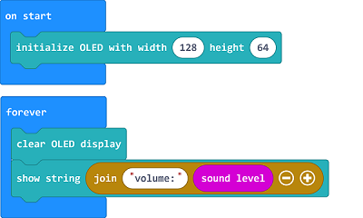
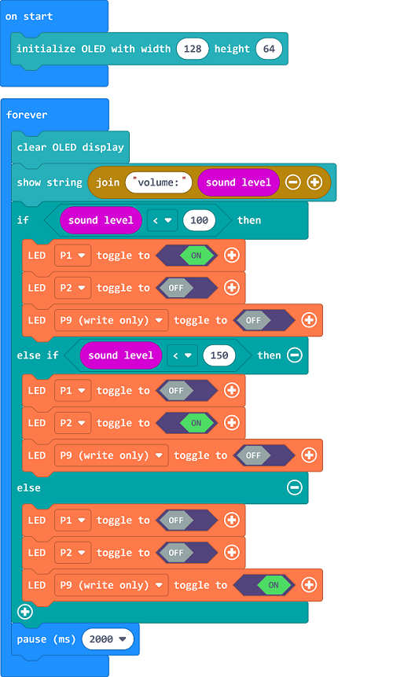

# Case 09: Noise Detection Device in the Library

##  Introduction 
---

- Noise has always been a serious problem in library management. If you stay in an environment above 85db for more than 8 hours, it will damage the hearing ability, although under normal circumstances the library will not have such a large source of noise , but the impact to readers from smaller noise cannot be ignored in the library . Thus, we can make a library noise detection device to remind people of the current environmental noise level.

##  Function

- Detect the noise level from the sound sensor on the micro:bit and have the value displayed on the OLED screen, program to light on the LED with the equivalent color. 

## Products Link
---
- 1 x [microbit Smart City Kit]()

## Picture
---

## Hardware Connection
---

Connect the green led to P1, the yellow to P2, the red to P9 and the OLED to the IIC  port on IoT:bit. 

## Software Program

---

Click "Advanced" in the MakeCode drawer to see more choices. 

For programming, we need to add a package: click "Extensions" at the bottom of the MakeCode drawer and search with "iot-environment-kit" in the dialogue box to download it. 

Notice: If you met a tip indicating that some codebases would be deleted due to incompatibility, you may continue as the tips say or create a new project in the menu. 

## Program

---

Initialize the OLED and display the sound level on the OLED screen. 

If the sound level is below 100, program to light on the green led, if it's below 150, program to light on the yellow led; or to light on the red led. 

Link: [https://makecode.microbit.org/_2D82PVTC2Vhr](https://makecode.microbit.org/_2D82PVTC2Vhr)

<iframe style="position:absolute;top:0;left:0;width:100%;height:100%;" src="https://makecode.microbit.org/#pub:https://makecode.microbit.org/_2D82PVTC2Vhr" frameborder="0" sandbox="allow-popups allow-forms allow-scripts allow-same-origin">
</iframe>

  

## Result
---
- Different LEDs are lightened in accordance with the equivalent sound level. 

