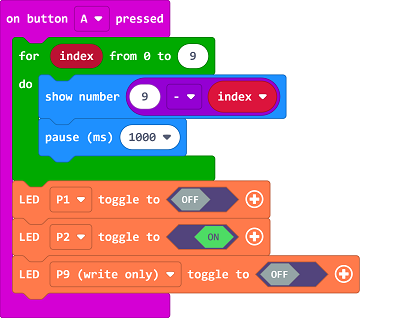
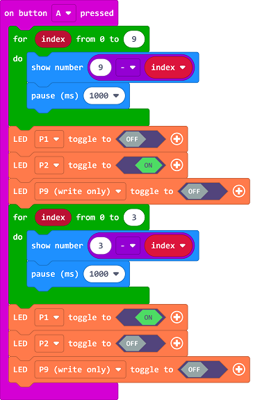
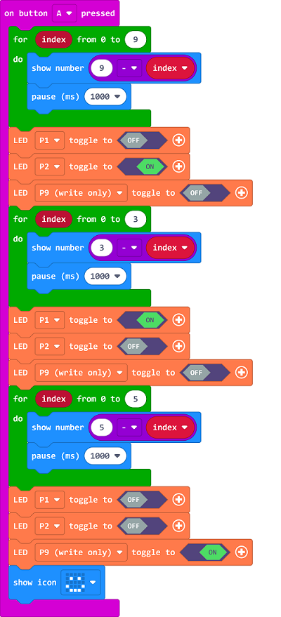

# Case 10: Push-button Crosswalk Traffic Lights

##  Introduction 
---

- Traffic ights enable effective traffic control, and have obvious effects on diverting traffic flow, improving road capacity, and reducing traffic accidents. But when there are no pedestrians to pass, the red light will reduce the driving efficiency, so we can make a push-button crosswalk traffic light. When someone needs to cross the road, press the button to triggering the green lights. 

##  Function 

- Press the button to activate the auto-timer for lighting on the equivalent traffic lights. 

## Products Link
---
- 1 x [microbit Smart City Kit]()

## Picture
---

## Hardware Connection
---

Connect the green led to P1, the yellow to P2, the red to P9 on IoT:bit. 

## Software Program

---

Click "Advanced" in the MakeCode drawer to see more choices. 

For programming, we need to add a package: click "Extensions" at the bottom of the MakeCode drawer and search with "iot-environment-kit" in the dialogue box to download it. 

Notice: If you met a tip indicating that some codebases would be deleted due to incompatibility, you may continue as the tips say or create a new project in the menu. 

## Program

---

On button A being pressed, program to count down from 10 on micro:bit display, and then light on the yellow led. 

After the yellow led gets turned on, set another countdown in 3 seconds for the green led. 

After the green led gets turned on, set another countdown in 5 seconds for the red led. 

Link: [https://makecode.microbit.org/_cjwYXhcDbXRE](https://makecode.microbit.org/_cjwYXhcDbXRE)

<iframe style="position:absolute;top:0;left:0;width:100%;height:100%;" src="https://makecode.microbit.org/#pub:https://makecode.microbit.org/_cjwYXhcDbXRE" frameborder="0" sandbox="allow-popups allow-forms allow-scripts allow-same-origin">
</iframe>

  

## Result
---
- Press button A to display the countdown time on the micro:bit, press the button to light on the red led for 10s, the yellow for 3s and the green for 5s. 

