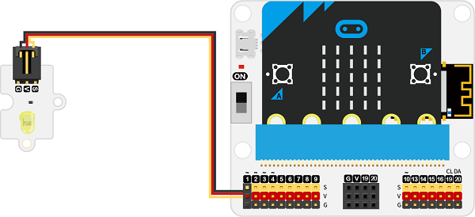
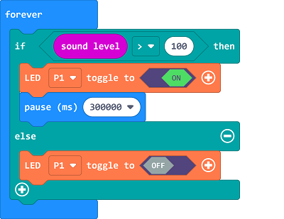

# Case 11: Smart Lamps for Basketball Courts

##  Introduction 
---

- In the city, there are places for citizens to exercise, such as basketball courts. Whenever it is night, the basketball court will always turn on the lights, thus, we can make a smart lighting that will automatically turn on the lights when it detects that someone is moving on the basketball court, otherwise it will automatically turn off the lights.

##  Function 
---

- Light on the lamps if there are people on the basketball courts and turn off the lamps if there is no one there. 

## Products Link
---
- 1 x [microbit Smart City Kit](https://shop.elecfreaks.com/products/elecfreaks-micro-bit-smart-city-kit-without-micro-bit-board?_pos=1&_sid=ce30b50b6&_ss=r)

## Picture
---

## Hardware Connection
---

Connect the yellow led to P1 port on IoT:bit. 

## Software Program

---

Click "Advanced" in the MakeCode drawer to see more choices. 

For programming, we need to add a package: click "Extensions" at the bottom of the MakeCode drawer and search with "iot-environment-kit" in the dialogue box to download it. 

***Notice:*** If you met a tip indicating that some codebases would be deleted due to incompatibility, you may continue as the tips say or create a new project in the menu. 

## Program

---

Judge the sound level, if the value is over the threshold, program to light on the LED; or program to turn off it. 

Link: [https://makecode.microbit.org/_VrMF7Da1uAib](https://makecode.microbit.org/_VrMF7Da1uAib)

<iframe style="position:absolute;top:0;left:0;width:100%;height:100%;" src="https://makecode.microbit.org/#pub:https://makecode.microbit.org/_VrMF7Da1uAib" frameborder="0" sandbox="allow-popups allow-forms allow-scripts allow-same-origin">
</iframe>

  

## Result
---
- If the sound level is over the threshold, it means there are people on the courts, program to light on the leds; or program to turn off the lights. 

