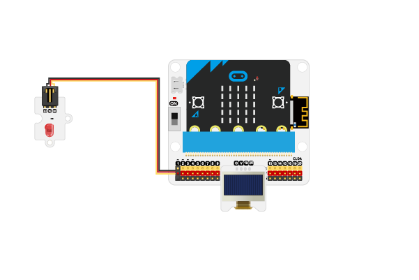
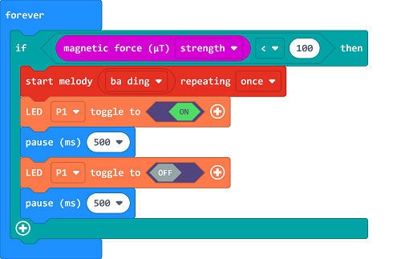

# Case 12: The Burglar Alarm in Shops

##  Introduction
---

- After installing the bulglar alarm device in shops, program to send alarms if someone breaks into the shops. 

##  Function

- Detect the magnet from the magnetic(compass) function on the micro:bit,  if the magnet goes far from the micro:bit, program to send alarms and light on the LED. 

## Products Link
---
- 1 x [microbit Smart City Kit]()
Note: A piece of magnet requires in this project.

## Picture
---

## Hardware Connection
---

Connect the red led to P1 port on IoT:bit. 

## Software Program

---

Click "Advanced" in the MakeCode drawer to see more choices. 

For programming, we need to add a package: click "Extensions" at the bottom of the MakeCode drawer and search with "iot-environment-kit" in the dialogue box to download it. 

Notice: If you met a tip indicating that some codebases would be deleted due to incompatibility, you may continue as the tips say or create a new project in the menu. 

## Program

---

Detect the magnetic intensity in the current field, if the returned value is below the threhold, program to send alarms and flash on the led. 

Link: [https://makecode.microbit.org/_0fiexRbyoKpE](https://makecode.microbit.org/_0fiexRbyoKpE)

<iframe style="position:absolute;top:0;left:0;width:100%;height:100%;" src="https://makecode.microbit.org/#pub:https://makecode.microbit.org/_0fiexRbyoKpE" frameborder="0" sandbox="allow-popups allow-forms allow-scripts allow-same-origin">
</iframe>

  

## Result
---
- If someone breaks into the shop, the device sends alarms and the led keeps flashing. 

