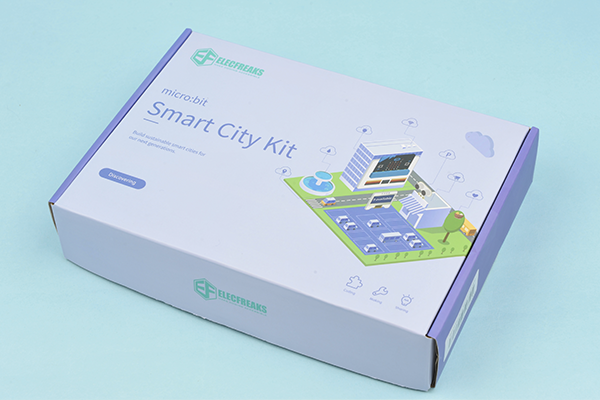

# micro:bit Smart City Kit

##  Introduction
---

- The Smart City Kit has a well-selection of IoT:bit, DHT11 sensor, soil moisture sensor, water level sensor, sonar:bit, servos and etc., we could use it to build such themes as the smart parking lot, transportation network and river level monitoring…, we can use it to learn more about the IoT and program, and more possibilities of the future city scenes are able to be constructed via it!

## Components List
---

Modules|Qty.|Note
:-:|:-:|:-:
micro:bit|1|Optional
IoT:bit|1|-
OLED Screen|1|-
LED-Red|1|-
LED-Yellow|1|-
LED-Green|1|-
DHT11 Sensor|1|-
Water Level Sensor|1|-
Soil Moisture Sensor|1|-
Sonar:bit|1|-
180° Servo|1|-
USB Cable|1|-
Manual Book|1|-

