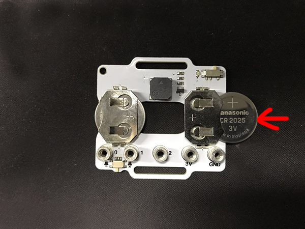
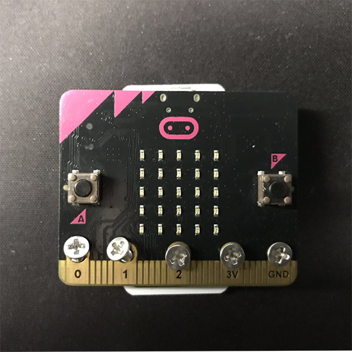
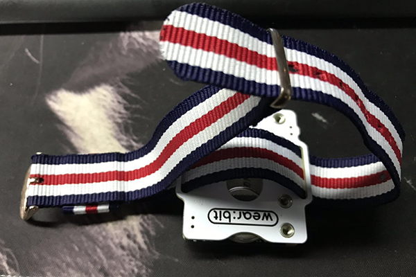
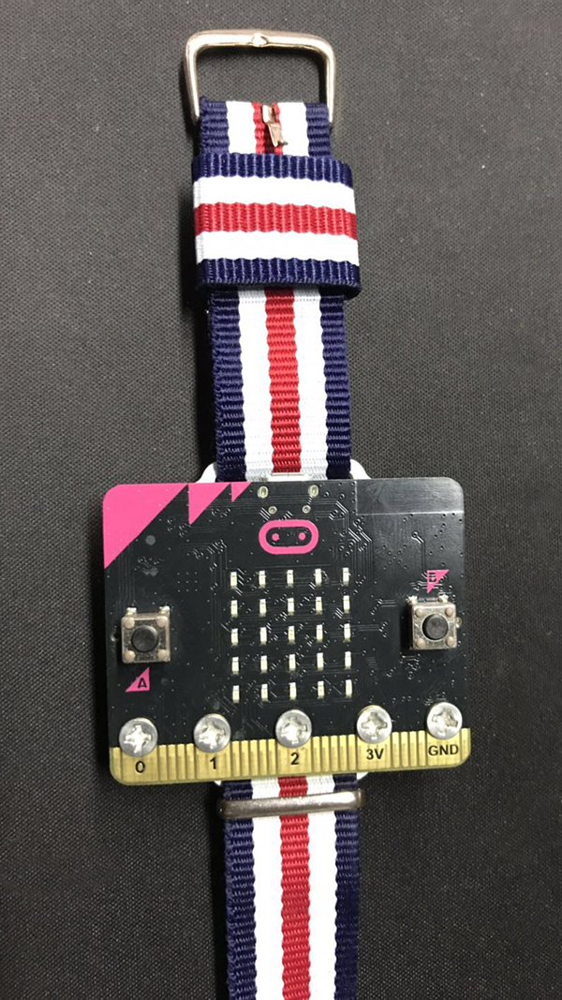

# Introduction to Smart Coding Kit

## Introduction

Elecfreaks Smart Coding Kit is a wearable device based on micro:bit button cell extension baord Pro, a DIY micro:bit watch can be easily made with a simple installing method. 

Smart Coding Kit is the updated version for the first generation Power Bit Watch Kit, the breakthroughs are: 

Simplify the installation without using the acrylic back shroud.

Maintain a simple style with 3-pin ports canceled. 

Upgrade the function by adding a switch for the buzzer.

## Products Link

[ELECFREAKS micro:bit Smart Coding Watch Kit](https://www.elecfreaks.com/micro-bit-smart-coding-kit.html)

## Assembling Diagram

 Install two 3V 2025 cells to the battery holder.

Fix the micro:bit to the button cell extension board Pro with screws.

 Pass the longer watch strap through the hole in the button panel Pro to install the watch strap.

## List

 1 x micro:bit
 1 xPower:bit
 1 x Nylon watch strap
 1 x micro USB wire 
 5 x M3x5 Inner cross screws 
 1 x MINI Screwdriver 
 1 x micro:bit guidebook 

## FAQ

