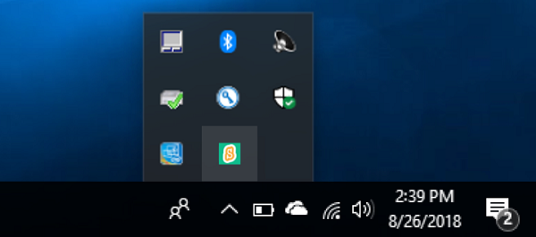
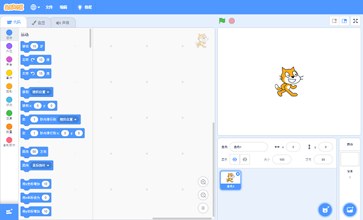
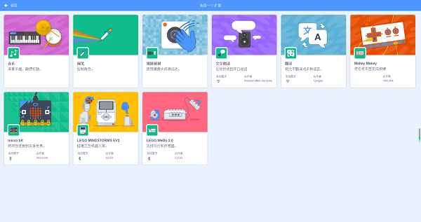
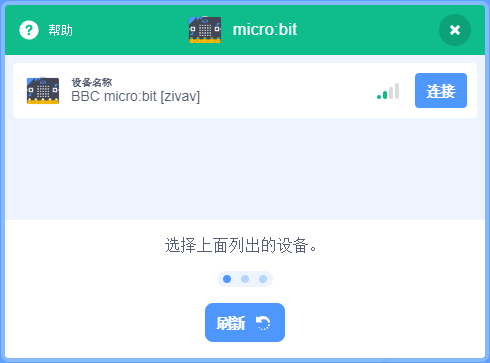
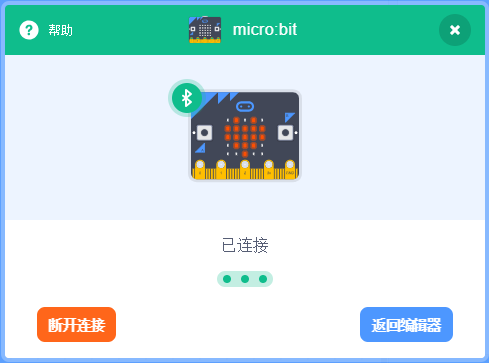

# Case 01: Connect Scratch-Windows

## Goal

 Connect Scratch with Smart Coding Kit.

## Products Link

 1 x [ELECFREAKS micro:bit Smart Coding Watch Kit](https://www.elecfreaks.com/micro-bit-smart-coding-kit.html)

 1 x computer(support Bluetooth)

## Background

### What is Scratch ? 

 [Scratch](https://en.wikipedia.org/wiki/Scratch) is a graphical programming tool developed by Lifelong Kindergarten Group from MIT, it suits for teenagers. 

## Software

 Scratch online programming link: [https://scratch.mit.edu/projects/editor](https://scratch.mit.edu/projects/editor)

 Scratch software download: https://scratch.mit.edu/download](https://scratch.mit.edu/download)

 Both the software and the online version are acceptable, you can choose one. 

 Scratch Link (Windows)：[https://downloads.scratch.mit.edu/link/windows.zip](https://downloads.scratch.mit.edu/link/windows.zip)

 Scratch Link (macOS)：[https://downloads.scratch.mit.edu/link/mac.zip](https://downloads.scratch.mit.edu/link/mac.zip)

 micro:bit firmware：[https://downloads.scratch.mit.edu/microbit/scratch-microbit-1.1.0.hex.zip](https://downloads.scratch.mit.edu/microbit/scratch-microbit-1.1.0.hex.zip)

## Connection Steps

### Step 1

 Connect the micro:bit to your computer and send the prepared micro:bit firmware to the micro:bit.

 Give power to micro:bit solely and the displaying characters on the micro:bit is the identification code for Bluetooth.

### Step 2

 Open Scratch Link and you will see an icon of it on the status bar. 

 Open the Scratch coding software, choose micro:bit expansion after clicking `+`  on the left bottom.

 Choose your micro:bit in the pop-up dialogue box. 

## Complete

 If connection is completed, the yellow exclamation mark changes to a green check mark.
 Now you can code the micro:bit with Scratch! 

## FAQ

**Fail to connect Scratch**

1. The lowest operation system version is listed at the top of this page.
2. Only one copy of the scratch can be connected to the micro:bit. If you have open the Scratch in other browsers, please close all of them and re-try. 
3. If there is another computer connecting to your micro:bit, please cut off the connection with another computer or yours, and re-try.
4. You might press the "reset" button between the USB connector and power supply connector on the back of the micro:bit while operating it, make sure your hands or feet be away from it!

## Relevant Files

Scratch official connection files: [https://scratch.mit.edu/microbit](https://scratch.mit.edu/microbit)

Scratch official website: [https://scratch.mit.edu](https://scratch.mit.edu)

