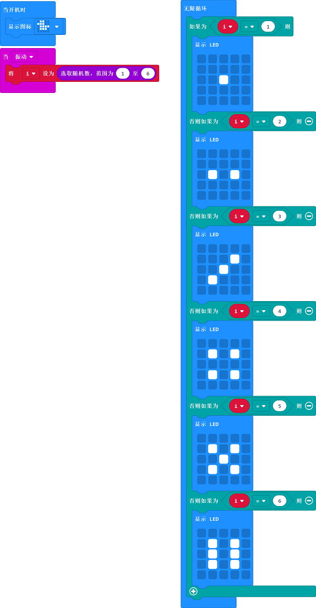

# Case 02: Dice

## Purpose
---
- Use the Smart Coding Kit to make a wearable dice. 

## Materials 
---

- 1 x smart coding kit 

## Software
---
[MicroSoftmakecode](https://makecode.microbit.org/#)

## Programming 
---

- Drag out an `on shake` block from `input`. Create a variable `num` and assign value to this variable with a random number among 1-6.
- Insert a `if` block. If the picked random number is 0, then display one point. If the random number is 2, then display two points. And so on.

### Link
- Link：[https://makecode.microbit.org/_hiRiC6PPT4Pd](https://makecode.microbit.org/_hiRiC6PPT4Pd)

- You can also download it directly below:

<iframe style="position:absolute;top:0;left:0;width:100%;height:100%;" src="https://makecode.microbit.org/#pub:_hiRiC6PPT4Pd" frameborder="0" sandbox="allow-popups allow-forms allow-scripts allow-same-origin"></iframe>
  
---

## Result
---

- A random number will be created each time when we shake our micro:bit.

## Exploration
---

## FAQ
---

## Relevant File
---

