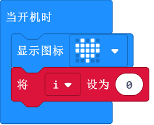
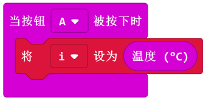

# Case 03: Thermometer

## Purpose
---
- Use the Smart Coding Kit to create a wearable thermometer. 

## Materials
---

- 1 x smart coding kit 

## Software
---

[MakeCodemakecode](https://makecode.microbit.org/#)

## Programming
---
### Step 1

- Create a variable `flag`. Initialize this variable to 0 when we startup our micro:bit. 

### Step 2

- Create a `forever` loop to show the variable `i`. If it is over the default value, it alarms; Or it does not alram. 

### Step 3

- When button A being pressed, set the returned value as `i` displaying on the micro:bit. 

### Link
- Link：[https://makecode.microbit.org/_hR9djPETmd38](https://makecode.microbit.org/_hR9djPETmd38)

- You can also download it below:

<iframe style="position:absolute;top:0;left:0;width:100%;height:100%;" src="https://makecode.microbit.org/#pub:_hR9djPETmd38" frameborder="0" sandbox="allow-popups allow-forms allow-scripts allow-same-origin"></iframe>
  
---

## Result
---

- The current value will be detected and displayed on the micro:bit when button A being pressed. 

## Exploration
---

## FAQ
---
Q: Sometimes the temperature is below 20 degrees, but the value detected is even higher? 

A: The temperature detected is the micro:bit chips but not the environment, the chips will get hot obviously when powering on for a long time. 

## Relevant File
---

