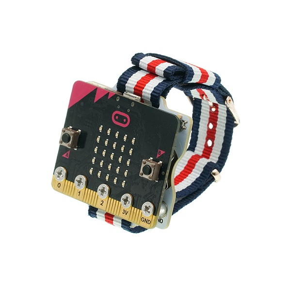
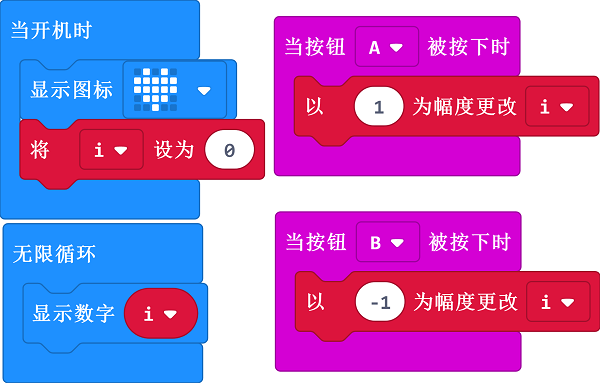

# Case 04: Counter

## Purpose
---
- Use the Smart Coding Kit to create a wearable counter. 

## Materials
---

- 1 x smart coding kit 

## Software
---

[MakeCodemakecode](https://makecode.microbit.org/#)

## Programming
---

- Programme to show icon while on start and set the variable `i` as 0; Set i=i+1 while button A being pressed, Set i=i-1 while button B being pressed. Drag the show digital block to the Forever block and choose to display `i` of the value of the variable. 

### Link
- Link：[https://makecode.microbit.org/_foxcuohURfzb](https://makecode.microbit.org/_foxcuohURfzb)

- You may also download it directly below:

<iframe style="position:absolute;top:0;left:0;width:100%;height:100%;" src="https://makecode.microbit.org/#pub:_foxcuohURfzb" frameborder="0" sandbox="allow-popups allow-forms allow-scripts allow-same-origin"></iframe>
  

## Result
---

- Start counting and displaying the results through button A or B. 

## Exploration
---

## FAQ
---

## Relevant File
---

