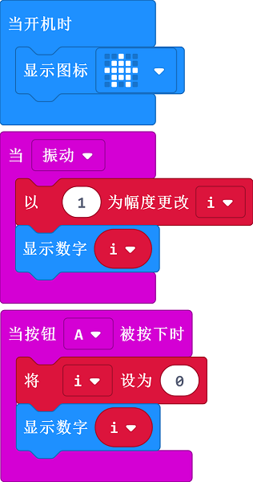

# Case 05: Pedometer

## Purpose

 Use the Smart Coding Kit to create a wearable pedometer. 

## Products Link

 1 x [ELECFREAKS micro:bit Smart Coding Watch Kit](https://www.elecfreaks.com/micro-bit-smart-coding-kit.html)

## Software

[MicroSoftmakecode](https://makecode.microbit.org/#)

## Programming

 Show the preset icon while on start; Set i=i+1 while on shake and display the value of the variable `i`; set `i` as 0 while button A being pressed and display the value of `i` at the same time.

### Link
 Link：[https://makecode.microbit.org/_LKJM7kAaw58M](https://makecode.microbit.org/_LKJM7kAaw58M)

 You can also download it direcly below:

<iframe style="position:absolute;top:0;left:0;width:100%;height:100%;" src="https://makecode.microbit.org/#pub:_LKJM7kAaw58M" frameborder="0" sandbox="allow-popups allow-forms allow-scripts allow-same-origin"></iframe>
  

## Result

While detecting the shake, the displaying number will add up 1 automatically for each time being detected,  and the value will be back to 0 once button A being pressed. 

## Exploration

## FAQ

## Relevant File

