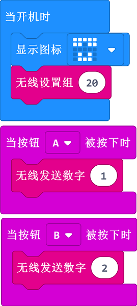
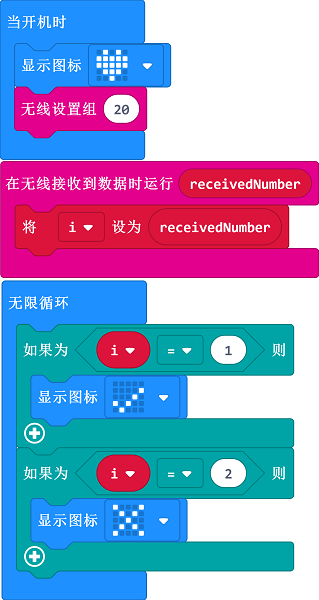

# Case 07: Wireless Communication

## Purpose

 Use the Smart Coding Kit to send signals. 

## Products Link

2 x [ELECFREAKS micro:bit Smart Coding Watch Kit](https://shop.elecfreaks.com/products/elecfreaks-micro-bit-smart-coding-watch-kit-without-micro-bit-board?_pos=2&_sid=ce4e7cb69&_ss=r)

## Software

[MicroSoftmakecode](https://makecode.microbit.org/#)

## Programming

### Step 1
 Sending end

 Show icon

 Set the wireless group

 Send number 1 when button A being pressed

 Send number 2 when button B being pressed

  

### Step 2
 Receiving end

 Show icon

 Set the wireless group

 Save the received number as variable i

 Judge the received number and display the icon accordingly.

  

### Link
 Sending end
 Link：[https://makecode.microbit.org/_ix81uXcAULqW](https://makecode.microbit.org/_ix81uXcAULqW)
 You can also download it direcly below:

<iframe style="position:absolute;top:0;left:0;width:100%;height:100%;" src="https://makecode.microbit.org/#pub:_ix81uXcAULqW" frameborder="0" sandbox="allow-popups allow-forms allow-scripts allow-same-origin"></iframe>
  
 Receiving end

 Link：[https://makecode.microbit.org/_WpqdARYUXWMj](https://makecode.microbit.org/_WpqdARYUXWMj)

 You can also download it direcly below:

<iframe style="position:absolute;top:0;left:0;width:100%;height:100%;" src="https://makecode.microbit.org/#pub:_WpqdARYUXWMj" frameborder="0" sandbox="allow-popups allow-forms allow-scripts allow-same-origin"></iframe>
  

## Result

 While button A or B in the sending end being pressed, an icon of `√` or `×` displays on the receiving end.

## Exploration

## FAQ

## Relevant File

