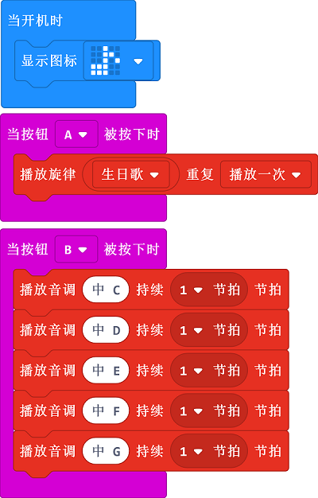

# Case 08: Play the Music

## Purpose

 Use the Smart Coding Kit to play a music.

## Products Link

 1 x [ELECFREAKS micro:bit Smart Coding Watch Kit](https://www.elecfreaks.com/micro-bit-smart-coding-kit.html)

## Software

[MicroSoftmakecode](https://makecode.microbit.org/#)

## Programming

 Show the icon when on start
 While button A being pressed, it plays the music of "Happy Birthday". 
 While button B being pressed, it plays the music that you set. 

### Link
 Link：[https://makecode.microbit.org/_D2JPv158u5o8](https://makecode.microbit.org/_D2JPv158u5o8)

 You can also download it direcly below:

<iframe style="position:absolute;top:0;left:0;width:100%;height:100%;" src="https://makecode.microbit.org/#pub:_D2JPv158u5o8" frameborder="0" sandbox="allow-popups allow-forms allow-scripts allow-same-origin"></iframe>
  

## Result

 Show the icon when on start
 While button A being pressed, it plays the music of "Happy Birthday". 
 While button B being pressed, it plays the music that you set. 

## Exploration

## FAQ

## Relevant File

