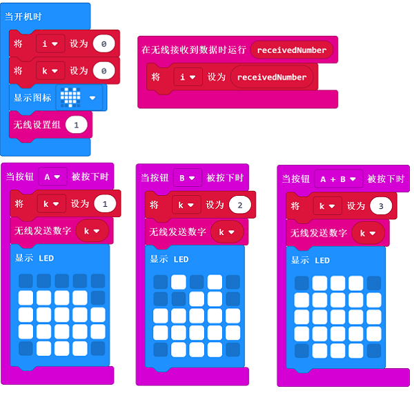
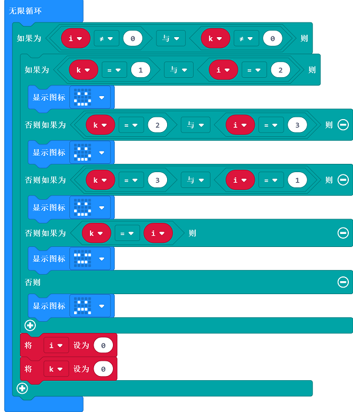

# Case 10: Finger-guessing game

## Purpose
---
- Use the Smart Coding Kit to create a finger-guessing game

## Material
---

- 1 x smart coding kit 

## Software
---
[MicroSoftmakecode](https://makecode.microbit.org/#)

## Programming
---
### Step 1
- Set both the variables "i" and "k" as 0 and show the on start icon

- Set the wireless group

- While pressing button A or/and B,  set the variable "k" as the equivalent number and send it to show the icon accordingly

- After receiving the data, save the data as variable "i"

  

### Step 2
- In the Forever block, judge the value of "i" and "k", if they are not 0, it means both the players give a “fist"
- The winner will be judged by the comparasion of "i" and "k"
- Set both the varibles "i" and "k" as 0 and be prepared for the next round 

### Link
- Link：[https://makecode.microbit.org/_0HpEjy3Dj8vY](https://makecode.microbit.org/_0HpEjy3Dj8vY)

- You can also download it direcly below:

<iframe style="position:absolute;top:0;left:0;width:100%;height:100%;" src="https://makecode.microbit.org/#pub:_0HpEjy3Dj8vY" frameborder="0" sandbox="allow-popups allow-forms allow-scripts allow-same-origin"></iframe>
  
---

## Result
---

Choose to give a "fist" through button A or/and B,  the results will be given accordingly, the winner has a smile face and the loser has a cry face on the micro:bit.

## Exploration

---

## FAQ

---

## Relevant File

---

