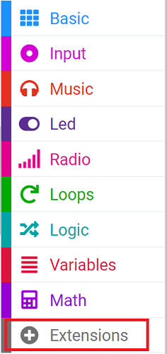
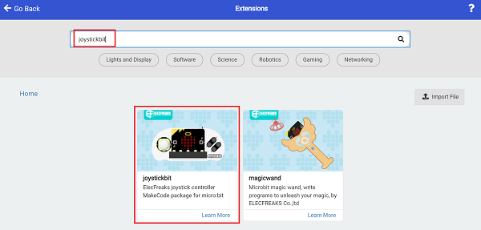

# Cutebot-Item Grabbing Car

## Purpose
Use a cutebot smart car with mechanical claws to create a car with the ability to grab items.

## Materials
1 × [Cutebot smart car](https://www.elecfreaks.com/micro-bit-smart-cutebot.html)
1 × [ELECFREAKS Mechanical Catch](https://www.elecfreaks.com/elecfreaks-mechanical-catch-use-with-cutebot.html)
1 x [Joystick:bit V2](https://www.elecfreaks.com/joystick-bit-2-for-micro-bit.html)

## Assembly

### The installation steps of mechanical claw:

### Connection methods:

Connect the mechanical claw to the S1 interface of the Cutebot car.

## Software

[MicroSoft Makecode](https://makecode.microbit.org/#)

## Program

### Add extensions
Click “Advanced” in the drawer of MakeCode to see more choices.

For programming, we need to add a package. Click “Extensions” at the bottom of the drawer and then search `Cutebot` in the dialogue box to download it.

For programming, we need to add a package. Click “Extensions” at the bottom of the drawer and then search `Joystick:bit V2` in the dialogue box to download it.

***Note:*** If you get a warning indicating some packages will be removed because of incompatibility issues, you can follow the prompts or create a new project in the menu.

### Program
### Cutebot

Link: [https://makecode.microbit.org/_H4MdUR2yChCp](https://makecode.microbit.org/_H4MdUR2yChCp)

You can also download the program directly from the following webpage.

<iframe style="position:absolute;top:0;left:0;width:100%;height:100%;" src="https://makecode.microbit.org/#pub:https://makecode.microbit.org/_H4MdUR2yChCp" frameborder="0" sandbox="allow-popups allow-forms allow-scripts allow-same-origin">
</iframe>

  

### Remote control

Link: [https://makecode.microbit.org/_6fy3K4Xctdgz](https://makecode.microbit.org/_6fy3K4Xctdgz)

You can also download the program directly from the following webpage.

<iframe style="position:absolute;top:0;left:0;width:100%;height:100%;" src="https://makecode.microbit.org/#pub:https://makecode.microbit.org/_6fy3K4Xctdgz" frameborder="0" sandbox="allow-popups allow-forms allow-scripts allow-same-origin">
</iframe>

  

## Result

If the moving direction of the car is controlled by the joystick, press the C/D button of the remote control to control the opening and grasping of the mechanical claw.

## Exploration

## FAQ
## Relevant reading