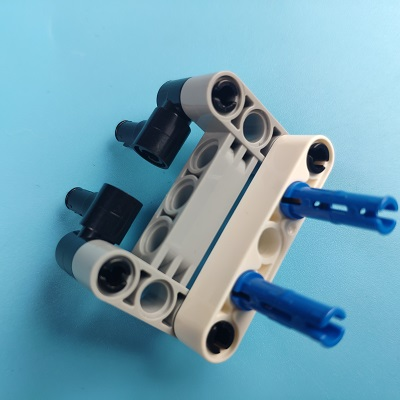
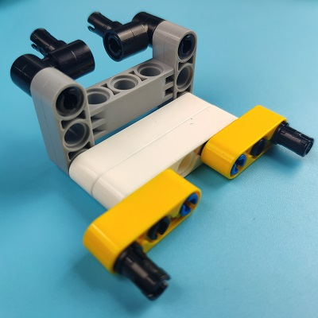

# Control the Cutebot with the Cards in Different Colors

## Purpose
Working with the AI lens, the Cutebot car is able to be controlled by starting moving or stopping by the cards in different colors. 

## Materials

1 × [Cutebot car](https://www.elecfreaks.com/micro-bit-smart-cutebot.html)

1 × [Cutebot lithium battery pack](https://www.elecfreaks.com/cutebot-lithium-battery-pack.html)

1 × [AI Lens](https://www.elecfreaks.com/elecfreaks-smart-ai-lens-kit.html)

*Note: AI lens is for Cutebot V 3.0 and above (you can see the version number printed on the base plate).*

## Assembly
### The installation steps of lithium battery pack:

### Construction steps of the building blocks：

Parts List:

Build steps；

### AI Lens connection：
Connect the RJ11 connector to the AI lens, and the other end of the Dupont cable connector to the location shown in the figure below, you need to pay attention to the correct interface of the connection cable.

*Note: This block stand structure is movable and we can manually adjust the viewing angle of the AI lens. When using the AI camera, the angle should be adjusted according to the functional requirements.*

## Software
[MicroSoft Makecode](https://makecode.microbit.org/#)

## Program

### Step 1:
Click “Advanced” in the drawer of MakeCode to see more choices.

For programming, we need to add a package. Click “Extensions” at the bottom of the drawer and then search `Cutebot` in the dialogue box to download it.

For programming, we need to add a package. Click “Extensions” at the bottom of the drawer and then search ` PlanetX-AI`in the dialogue box to download it.

***Note:*** If you get a warning indicating some packages will be removed because of incompatibility issues, you can follow the prompts or create a new project in the menu.

### Step 2: 

In `on start`, initialize the AI lens, switch the lens function to color recognition mode, and initialize the rainbow light.

In `Forever`,get the information of a frame from the lens, if the image contains red card, the cart stops and shows red light, if the image contains green card, the cart moves forward and shows green light.

### Program

Link: [https://makecode.microbit.org/_2781gFCseJMs](https://makecode.microbit.org/_2781gFCseJMs)

You can also download the program directly from the following webpage.

<iframe style="position:absolute;top:0;left:0;width:100%;height:100%;" src="https://makecode.microbit.org/#pub:https://makecode.microbit.org/_2781gFCseJMs" frameborder="0" sandbox="allow-popups allow-forms allow-scripts allow-same-origin">
</iframe>

  

## Result

When the AI lens detects a red card, the cart stops and shows a red light, and when the AI lens detects a green card, the cart continues moving forward and shows a green light.

## Exploration

Is it possible to set more functions for Cutebot smart car and switch functions by recognizing color cards?

## FAQ
---
## Relevant reading
---
