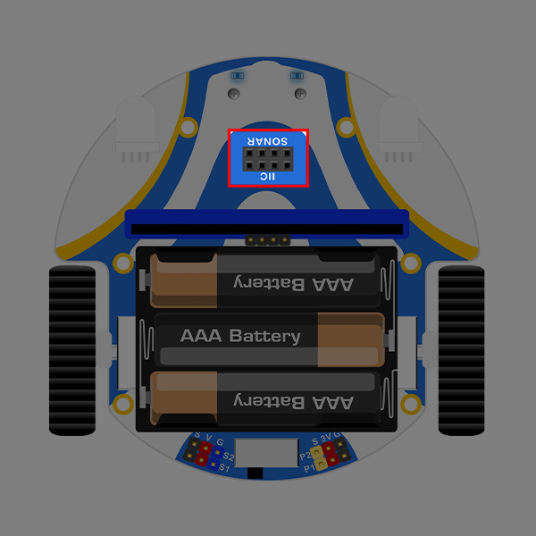
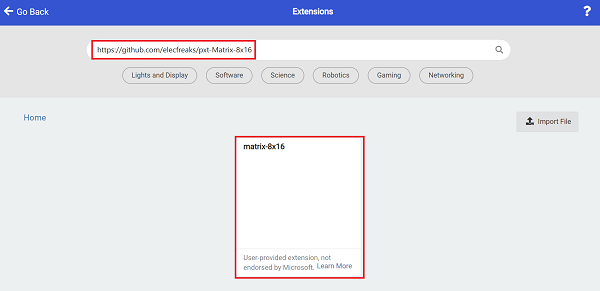
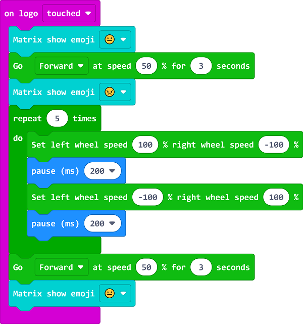

# The Angry Cutebot

## Purpose
Display the expressions through an 8 x 16 dot matrix screen.

## Materials

1 × [Cutebot smart car](https://shop.elecfreaks.com/products/elecfreaks-micro-bit-smart-cutebot-kit-without-micro-bit-board?_pos=1&_sid=4c6909119&_ss=r)

1 × [ELECFREAKS 8x16 Matrix Module](https://shop.elecfreaks.com/products/elecfreaks-8x16-matrix-module?_pos=1&_sid=38247e8ea&_ss=r)

### Hardware Connections
Plug the 8*16 dot matrix screen into the IIC interface of cutebot car, you need to pay attention to whether the connection interface is correct.

## Software
[MicroSoft Makecode](https://makecode.microbit.org/#)

## Program
### Add extensions
Click “Advanced” in the drawer of MakeCode to see more choices.

For programming, we need to add a package. Click “Extensions” at the bottom of the drawer and then search `Cutebot` in the dialogue box to download it.

In order to program the 8*16 dot matrix screen, we need to add a code library. Find "Extensions" at the bottom of the code drawer and click on it. This will bring up a dialog box. Search for ` https://github.com/elecfreaks/pxt-Matrix-8x16 ` and click to Download it.

***Note:*** If you get a warning indicating some packages will be removed because of incompatibility issues, you can follow the prompts or create a new project in the menu.

### Program

Link: [https://makecode.microbit.org/_8TiMd6VcEd6f](https://makecode.microbit.org/_8TiMd6VcEd6f)

You can also download the program directly from the following webpage.

<iframe style="position:absolute;top:0;left:0;width:100%;height:100%;" src="https://makecode.microbit.org/#pub:https://makecode.microbit.org/_8TiMd6VcEd6f" frameborder="0" sandbox="allow-popups allow-forms allow-scripts allow-same-origin">
</iframe>

  

## Result

When the micro:bit V2 logo is touched, the 8×16 dot matrix screen displays expressions and the cutebot smart car moves forward.

## Exploration

