# The Combat Cart-1

## Purpose
Use the Cutebot smart car to create a cart that can push opponents off the playing field or lose their ability to move.

## Materials
1 × [Cutebot smart car](https://www.elecfreaks.com/micro-bit-smart-cutebot.html)
1 × [Cutebot lithium battery pack](https://www.elecfreaks.com/cutebot-lithium-battery-pack.html)
n × Building blocks (blocks need to be prepared by yourself)

## Assembly
### The installation steps of lithium battery pack:

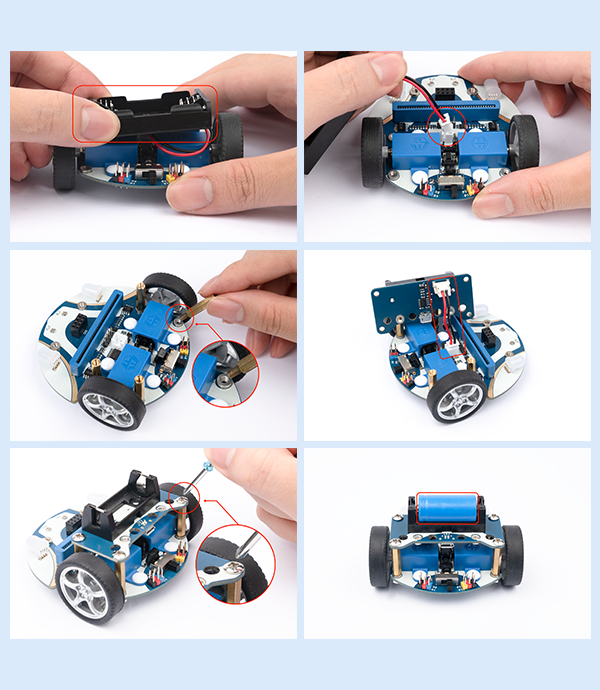

### Construction steps of the building blocks：

Parts List:

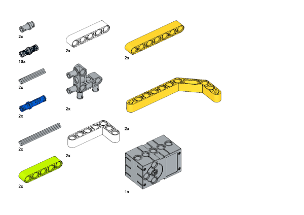

Build steps：

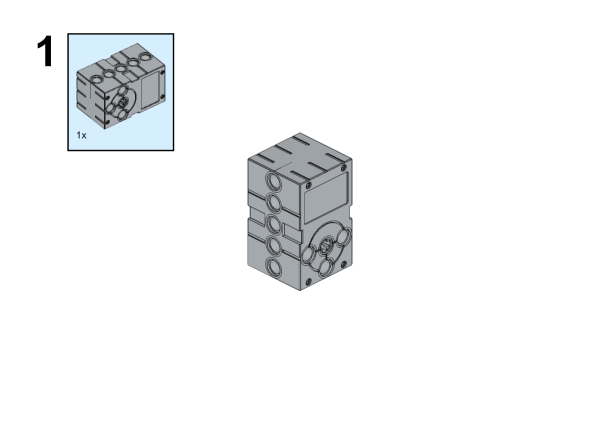

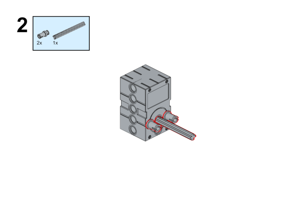

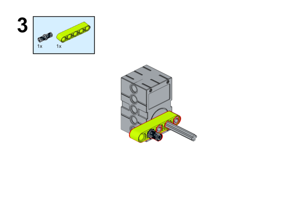

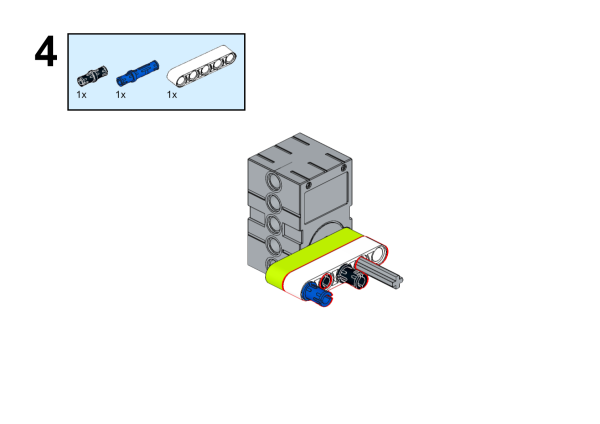

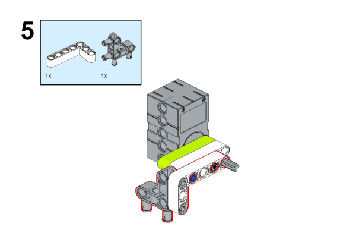

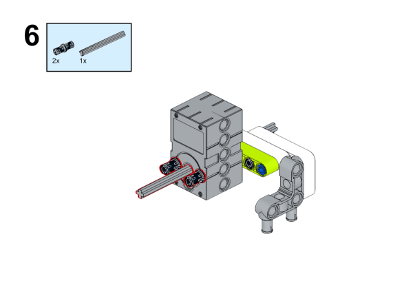

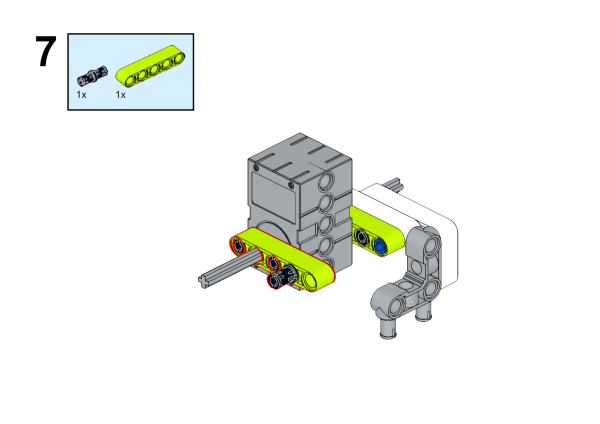

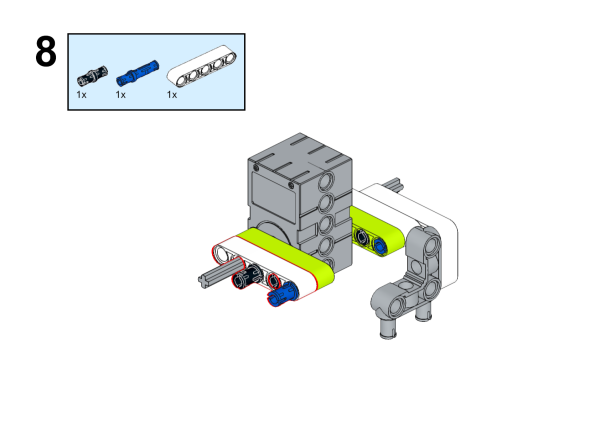

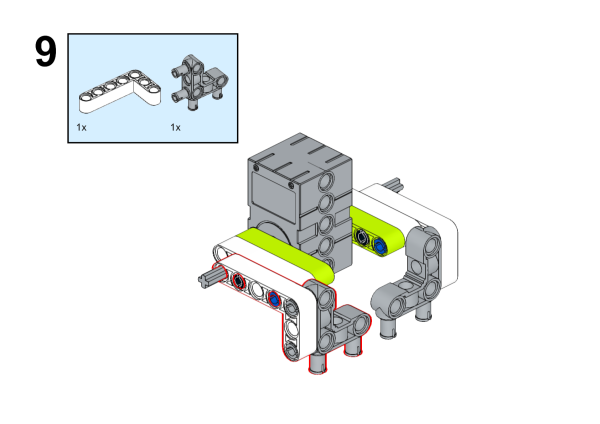

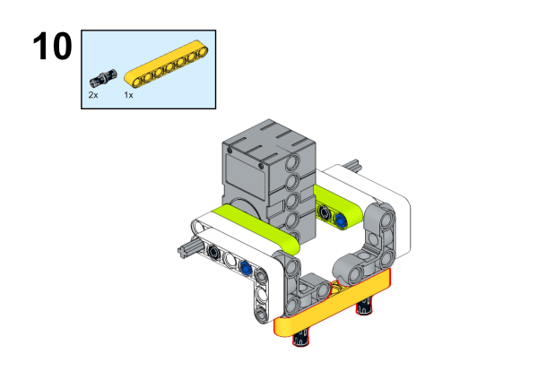

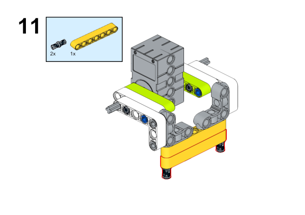

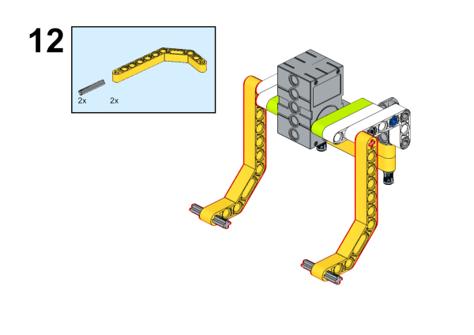

## Connection method

Connect the servo to the S1 of the cutebot smart car.

## Software

[MicroSoft Makecode](https://makecode.microbit.org/#)

## Program

### Add extension
Click “Advanced” in the drawer of MakeCode to see more choices.

For programming, we need to add a package. Click “Extensions” at the bottom of the drawer and then search `Cutebot` in the dialogue box to download it.

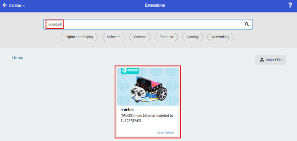

For programming, we need to add a package. Click “Extensions” at the bottom of the drawer and then search `Joystick:bit V2` in the dialogue box to download it.

***Note:*** If you get a warning indicating some packages will be removed because of incompatibility issues, you can follow the prompts or create a new project in the menu.

### Program
### Cutebot

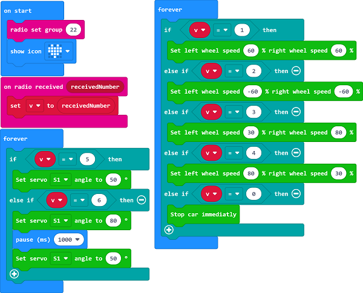

Link: https://makecode.microbit.org/_6kD6KAaEfA8W](https://makecode.microbit.org/_6kD6KAaEfA8W)

You can also download the program directly from the following webpage.

<iframe style="position:absolute;top:0;left:0;width:100%;height:100%;" src="https://makecode.microbit.org/#pub:https://makecode.microbit.org/_6kD6KAaEfA8W" frameborder="0" sandbox="allow-popups allow-forms allow-scripts allow-same-origin">
</iframe>

  

### Remote control part

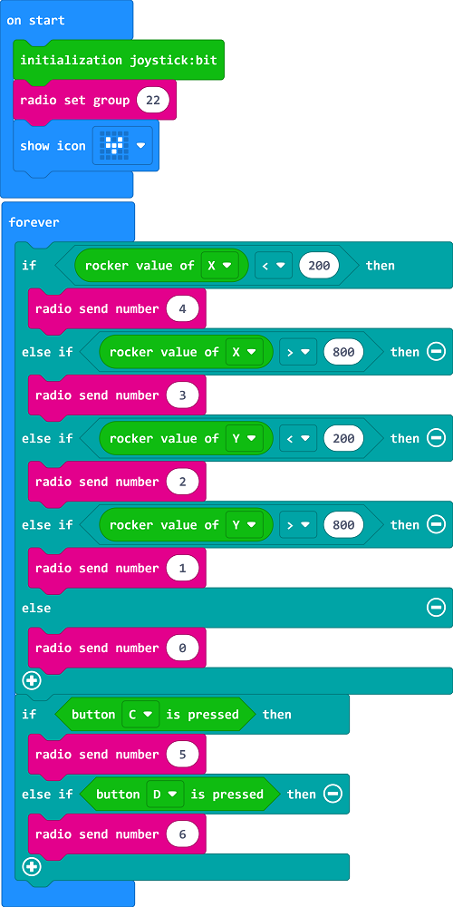

Link: [https://makecode.microbit.org/_6fy3K4Xctdgz](https://makecode.microbit.org/_6fy3K4Xctdgz)

You can also download the program directly from the following webpage.

<iframe style="position:absolute;top:0;left:0;width:100%;height:100%;" src="https://makecode.microbit.org/#pub:https://makecode.microbit.org/_6fy3K4Xctdgz" frameborder="0" sandbox="allow-popups allow-forms allow-scripts allow-same-origin">
</iframe>

  

## Result

If you control the driving direction of the car by the rocker of the remote control, press the C/D button of the remote control to control the servo action.

