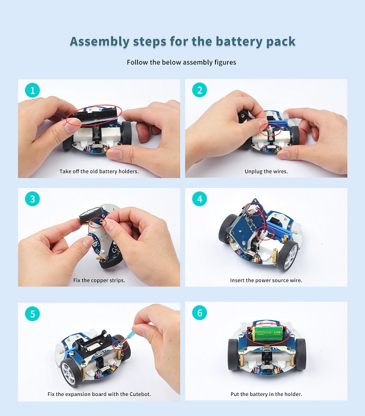
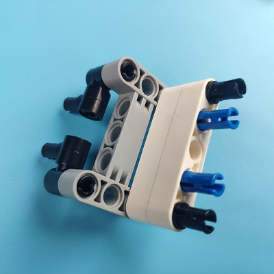
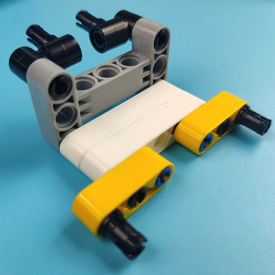
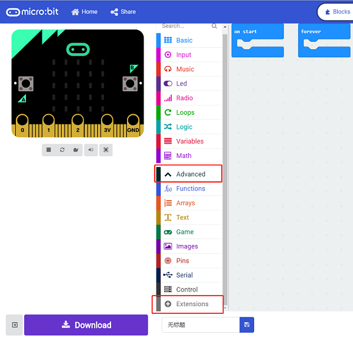
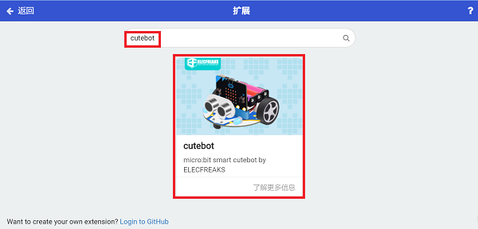
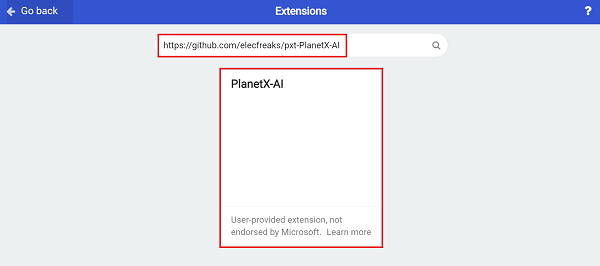
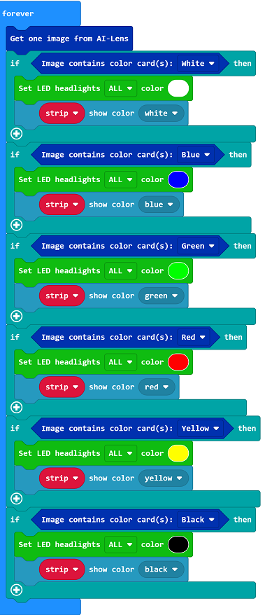
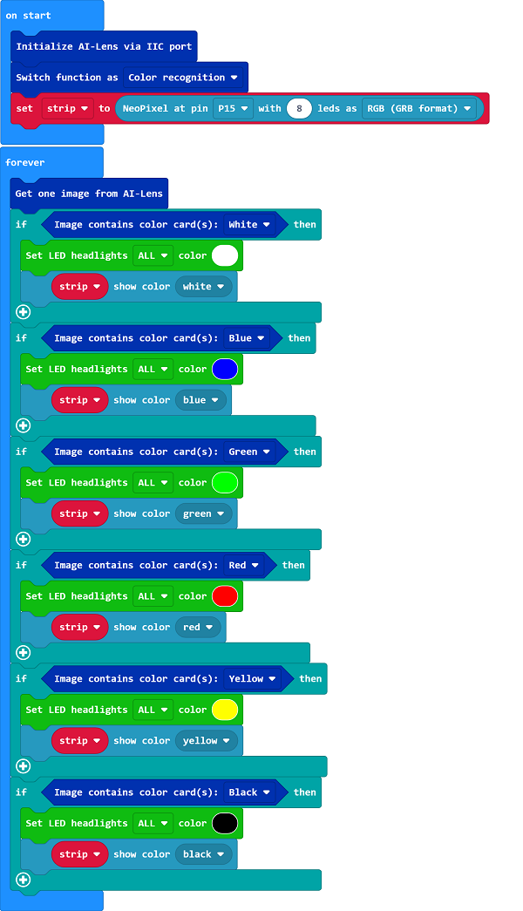

# Cutebot & AI Lens Discoloring Lights

## Purpose
---
- Change the color of the lights via the color of the cards with the Smart AI Lens.

## Materials required

---

- 1 × [Cutebot V3.0](https://www.elecfreaks.com/micro-bit-smart-cutebot.html)

- 1 × [Cutebot lithium battery pack](https://www.elecfreaks.com/cutebot-lithium-battery-pack.html)

- 1 × [AI Lens Kit](https://www.elecfreaks.com/elecfreaks-smart-ai-lens-kit.html)

  *Note: The AI Lens kit works with Cutebot V3.0 only(You can see the version number printed on the baseboard).*

## Connections:

---

### Steps to install the lithium battery pack: 

Assembly steps for bricks:

Parts list:

Steps of build-up:

### Connections of the AI Lens: 

Connect the RJ11 cable with the AI Lens and the other end in Dupont connection to the circled place in the below picture (make sure you connect to the right connections).

*Tips: the bricks holder here is flexible to be adjusted, we may manually adjust the angles of the AI lens to meet the requirements of the functions that you want to achieve.*

## Software Platform:

---

[MicroSoft MakeCode](https://makecode.microbit.org/#)

## Programming

---

### Step 1

Click “Advanced” in the drawer to see more choices.

- We need to add a package for programming. Click “Extensions” in the bottom of the drawer and search with “cutebot” in the dialogue box to download it.

We need to add a package for programming the AI lens kit. Click “Extensions” in the bottom of the drawer and search with “https://github.com/elecfreaks/pxt-PlanetX-AI” in the dialogue box to download it.

*Note: If you met a tip indicating that the codebase will be deleted due to incompatibility, you may continue as the tips say or build a new project in the menu.*

###  Step 2

- In the “on start” brick, initialize the AI lens and switch the function to the color recognition mode, set the RainbowLED lights connect to P15 port. 

- In the “forever” brick, set to get one image form the AI lens and judge the cards color on the image. If it reconizes the white color, we set the LED headlights and signal lights in white; if we recognizes the blue color, we set the LED headlights and signal lights in blue, by analogy, we programme with green, red, yellow and black card in the same way. 

### Code

Link: [https://makecode.microbit.org/_L36f3yaJgTVH](https://makecode.microbit.org/_L36f3yaJgTVH)

You may also download it directly below:

<iframe style="position:absolute;top:0;left:0;width:100%;height:100%;" src="https://makecode.microbit.org/#pub:https://makecode.microbit.org/_L36f3yaJgTVH" frameborder="0" sandbox="allow-popups allow-forms allow-scripts allow-same-origin">
</iframe>

  
---

## Result
---
- The lights change the color in accordance with the color of the cards. 

## Exploration

---

## FAQ

---

## Relevant Files 

---
