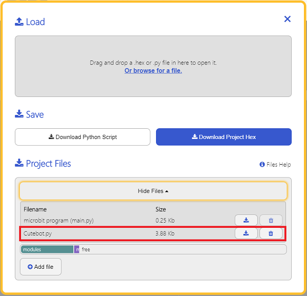

# Smart Cutebot Samples for Python

---


### Add Python File
Download to unzip it: [EF_Produce_MicroPython-master](https://github.com/elecfreaks/EF_Produce_MicroPython/archive/refs/heads/master.zip)
Go to  [Python editor](https://python.microbit.org/v/2.0)


We need to add Cutebot.py for programming. Click "Load/Save" and then click "Show Files (1)" to see more choices, click "Add file" to add Cutebot.py from the unzipped package of EF_Produce_MicroPython-master. 




## API
---
`CUTEBOT(object)`

Create an object.

`set_motors_speed(self, left_wheel_speed: int, right_wheel_speed: int)`

Set the speed of both wheels: 

        `left_wheel_speed: int` Speed of the left: -100～100
        `right_wheel_speed: int` Speed of the right: -100～100

`set_car_light(self, light: int, R: int, G: int, B: int)`

Set the color of the headlights：

        `light`:Choose the lights
        `R`:channel color-255`
        `G`:channel color-255`
        `B`:channel color-255`
        


`get_distance(self, unit: int = 0)`

Get the distance from the ultrasonic sound sensor:

        `unit`detecting the distances:` 0 `cm,` 1 `lnch
        
         

`get_tracking(self)`

Get the status from the tracking headers:

        return:`00` all in white
               `10` left in black and right in white
               `01` left in white and right in black
               `11` all in black
               

`set_servo(self, servo, angle)`

Choose the servos and set the angles/speed: 

            `servo (number)`choose the servos 1,2
           `angle (number)`set the angles of the servo 0~180


### Samples
### Sample 1: Drive the car at a full speed. 
```
from microbit import *
from Cutebot import *
ct = CUTEBOT()
ct.set_motors_speed(100, 100)

```
### Result
- The speed of the left and right wheels is at 100, the car moves forward at the full speed. 


### Sample 2: Turn the headlights on
```
from microbit import *
from Cutebot import *
ct = CUTEBOT()
ct.set_car_light(left, 0, 90, 90)
ct.set_car_light(right, 200, 200, 0)
```
### Result
- The two headlights light up in different colours. 

### Sample 3: Obstacles avoidance 
```
from microbit import *
from Cutebot import *

dis = CUTEBOT()

while(True):
    i = dis.get_distance(0)
    if i>3 and i<20:
        dis.set_motors_speed(-50, 50)
        sleep(500)
    else:
        dis.set_motors_speed(50, 50)
```
### Result
- The Cutebot turns its direction once it detects any obstacle ahead of it. 

### Sample 4: Line-tracking 
```
from microbit import *
from Cutebot import *

dis = CUTEBOT()

while(True):
    i = dis.get_tracking()
    if i == 10:
        dis.set_motors_speed(10, 50)
    if i == 1:
        dis.set_motors_speed(50, 10)   
    if i == 11:
        dis.set_motors_speed(25, 25)  
```
### Result

- The Cutebot drives along with the black line. 

### Sample 5:  Control the servo  
```
from microbit import *
from Cutebot import *

dis = CUTEBOT()

while(True):
    dis.set_servo(0,180)
    sleep(1000)
    dis.set_servo(0,0)
    sleep(1000)
```
### Result
- The servo connecting to S1 continues driving back and forth. 

## FAQ
---
About the reported error:

 |ValueError|Error content|
 |:---:|:---:|
 |speed error,-100~100|The speed of the left/right wheel is beyond the threshold that we set|
 |RGB is error|The parameter of the color of the headlight is beyond the threshold that we set|
 |select servo error,1,2|The parameter of the servo connections is wrong|
 |angle error,0~180|The setting to the angles of the servos is wrong|


## Relevant Case
---

## Technique File
---
