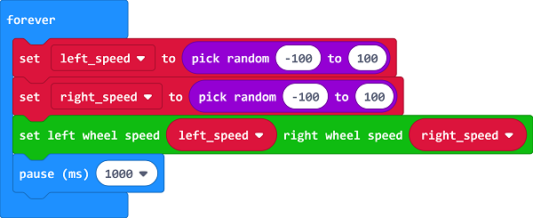

# Case 04: Run at Random

## Purpose
---
- Make your Cutebot move(move forward, reverse or change direction) as if in "his" mind. 

## Materials 
---
- 1 x [CutebotKit](https://www.elecfreaks.com/micro-bit-smart-cutebot.html)

## Software Platform 
---
[MicroSoft makecode](https://makecode.microbit.org/#)

## Programming
---
- ### Step 1

  - Click the "Advanced" to see more choices in the MakeCode drawer.

- A codebase is required for Cutebot programming, click “Add Package” at the bottom of the drawer, search `Cutebot` in the dialogue box and download it.

Note: If you met a tip indicating incompatibility of the codebase, you can continue with the tips or build a new project there.

### Step 2

- Choose "show icon" in the `On start`bricks.

### Step 3

- Drag `left_speed` and `right_speed` bricks into `forever` brick to set a speed at random from `-100` to `100` of the two wheels.
- Assign the two variables of the speed to the left and right wheels.

### Programming

Links: [https://makecode.microbit.org/_ECTDYXJJiRLk](https://makecode.microbit.org/_ECTDYXJJiRLk)

You can also download it directly below:

<iframe style="position:absolute;top:0;left:0;width:100%;height:100%;" src="https://makecode.microbit.org/#pub:https://makecode.microbit.org/_ECTDYXJJiRLk" frameborder="0" sandbox="allow-popups allow-forms allow-scripts allow-same-origin">
</iframe>

  
---

## Result
---
- 小车随机前进，后退或者转向。 The Cutebot moves forward, reverses or changes its direction at random.

## Exploration
---

## FAQ

------

## Relevant Files

---
