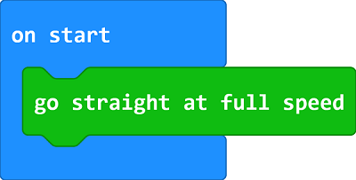
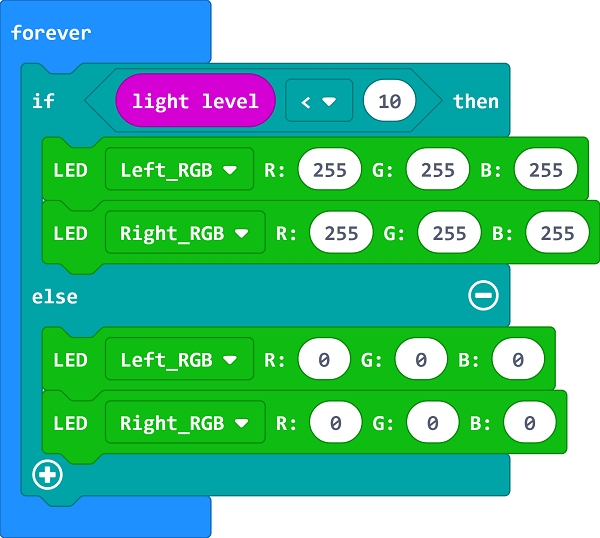

# Case 05: Automatic Headlights

## Purpose
---
- Make your Cutebot turn on its headlights automatically in the darkness. 

## Materials 
---
- 1 x [Cutebot Kit](https://www.elecfreaks.com/micro-bit-smart-cutebot.html)

## Software Platform 
---
[MicroSoft makecode](https://makecode.microbit.org/#)

## Programming
---
### Step 1
- Click the "Advanced" to see more choices in the MakeCode drawer.

- A codebase is required for Cutebot programming, click “Add Package” at the bottom of the drawer, search `Cutebot` in the dialogue box and download it.

***Note:*** If you met a tip indicating incompatibility of the codebase, you can continue with the tips or build a new project there.

### Step 2

- Set go straight at full speed in `On start`. 

### Step 3

- Drag "If...else..." brick into `forever` brick to judge if the light level is below `10`, if yes, set the value of both RGB LEDs as `255`, (The combined light is white). 
- While the value is over `10`, set the value of both RGB LEDs as `0` to turn off the lights.

### Programming

Links: [https://makecode.microbit.org/_eybE8UXKx9hm](https://makecode.microbit.org/_eybE8UXKx9hm)

You can also download it directly below:

<iframe style="position:absolute;top:0;left:0;width:100%;height:100%;" src="https://makecode.microbit.org/#pub:https://makecode.microbit.org/_eybE8UXKx9hm" frameborder="0" sandbox="allow-popups allow-forms allow-scripts allow-same-origin">
</iframe>

  

## Result
---
- The headlights turn on automatically  when going into the darkness and turn off after passing the darkness area.

## Exploration
---
- How to program to make the lights turn on in different colors when going into the darkness in different time? (The value of RGB helps to set the color)

## FAQ
---

## Relevant Files
---
